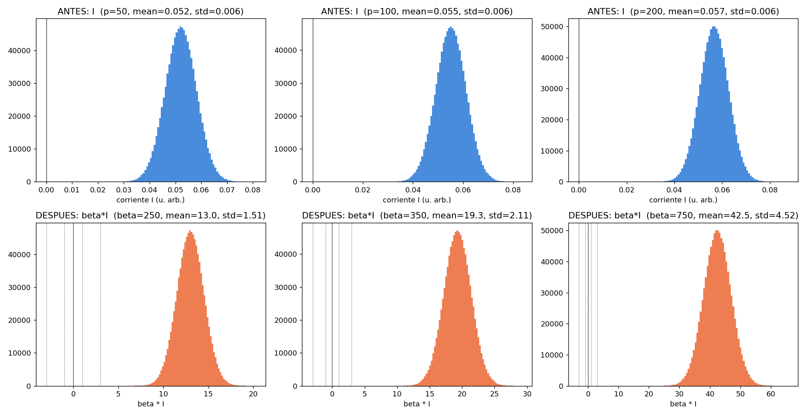

# Correlación entre las corrientes Monte Carlo de `analisis_beta_optimo.py` y los β óptimos reales

Walter Quiñonez · Reporte generado con Claude Code · 5 de septiembre de 2026

Este reporte analiza el método que usa `analisis_beta_optimo.py` para
estimar β óptimo, y correlaciona la distribución Monte Carlo de la corriente
que ese script construye —**antes** y **después** de escalarla por los β
óptimos que efectivamente se encontraron por grid-search con entrenamiento
completo (`data_beta_grid_search_SP/resumen_por_INL/resumen_optimos.csv`)—
para explicar por qué esos β no la llevan a una escala razonable.

## 1. El método de `analisis_beta_optimo.py`

Para cada una de 3 configuraciones (`p=50, a=48.83`; `p=100, a=98.55`;
`p=200, a=197.99` — las tres del grupo INL nominal 1e-2), el script:

1. Genera las curvas `pot`, `dep` con `generar_curvas_pot_dep(...)`.
2. Construye **`wij[i,j] = pot[i] − dep[j]` para TODAS las combinaciones
   i,j** (matriz combinatoria completa, tamaño `len(pot) × len(dep)`). Esto
   es distinto de cómo se inicializa la red real: en
   `G0_initialization('random', ...)` tanto `G⁺` como `G⁻` se sortean,
   independientemente, del mismo *pool combinado* {pot}∪{dep} — acá en
   cambio se asume que `G⁺` sale siempre de la curva `pot` y `G⁻` siempre de
   `dep`, comparando cada punto de una curva contra *todos* los puntos de
   la otra.
3. Construye **`histograma[i,j] = voltaje_i · wij_j`** (outer product), con
   `voltajes = np.unique(X_train)` — los **256 niveles de gris distintos**
   presentes en MNIST, cada uno con **el mismo peso**.
4. Corre un **Monte Carlo de la corriente**: `I = Σ` de 784 términos
   elegidos al azar (con reposición) de ese pool de productos `V·W` — 1
   millón de repeticiones (`np.random.choice(x, size=784)` repetido).
5. Con la distribución resultante de `I`, imprime tres candidatos de
   β óptimo:
   - `|1/mean(I)|`
   - `|1/std(I) + mean(I)|`
   - `1/RMS(I)`
6. Finalmente grafica `beta[r] * I` usando **los β óptimos ya encontrados
   en el experimento real** (`betas = [250, 350, 750]`, que coinciden
   exactamente con los de `resumen_optimos.csv` para p=50/100/200 en
   INL=1e-2) — este es el paso "antes/después" pedido.

El propio script trae una nota del autor fechada 18/08: *"no muestra nada
definitivo para relacionar con un beta óptimo"*.

## 2. Reproducción y resultados numéricos

Script nuevo (no modifica `analisis_beta_optimo.py`):
[`reproducir_analisis_beta_optimo.py`](reproducir_analisis_beta_optimo.py)
— mismos parámetros y mismo método; solo vectoriza el Monte Carlo por
chunks (en vez de 1.000.000 de llamadas a `np.random.choice` en un
for-loop de Python) para poder correrlo en segundos, y guarda resultados en
vez de abrir ventanas interactivas.

| p | β óptimo (experimento) | mean(I) | std(I) | mean(I)/std(I) | β·mean(I) | β·std(I) | %\|β·I\|>3 |
|---|---:|---:|---:|---:|---:|---:|---:|
| 50  | 250 | 0.05211 | 0.00605 | 8.61 | 13.03 | 1.51 | 100% |
| 100 | 350 | 0.05513 | 0.00604 | 9.13 | 19.30 | 2.11 | 100% |
| 200 | 750 | 0.05665 | 0.00603 | 9.39 | 42.49 | 4.52 | 100% |

*Arriba: distribución Monte Carlo de `I` (1M muestras) para cada curva.
Abajo: la misma distribución escalada por el β óptimo real de esa curva,
con líneas de referencia en −3,−1,0,1,3. Nótese que las líneas de
referencia quedan pegadas al cero, muy lejos del grueso de la distribución.*

## 3. El hallazgo central

**La distribución de `I` no está centrada en cero.** Su media es entre 8.6
y 9.4 veces su propio desvío estándar — es decir, en esta construcción de
Monte Carlo, `I` se comporta como una constante grande con una fluctuación
chica alrededor, no como una variable de media aproximadamente nula con
dispersión `σ_I` (que es la premisa de la Ec. (*) del reporte analítico
previo: `E[I]≈0` porque las curvas son "diferenciales").

Al multiplicar por el β óptimo real, la distribución se corre y se ensancha
proporcionalmente, pero la razón media/desvío se conserva (8.6–9.4): el
**100% de las muestras** caen con `|β·I|>3`, y la media escalada crece de
13 a 42 según `p` — es decir, la fórmula recomendada de mantener el
argumento de la no linealidad en una escala `O(1)` (LeCun/Prezioso) parece
violarse por completo con este β, y la violación **empeora con p** — justo
en la misma dirección en que ya se había visto (en el reporte de
validación anterior) que β óptimo crecía sin que `σ_W` lo explicara.

## 4. Por qué pasa esto (verificado numéricamente)

`mean(I) = 784 · E[V] · E[W]`, y **ninguno de los dos factores es cero**
aquí (`diagnostico_voltajes.csv`):

| Cantidad | Valor |
|---|---:|
| E[V] — voltajes únicos, equipesados (como usa el script) | **0.500** |
| E[V] — X_train real, todos los píxeles, pesado por frecuencia | **0.131** |
| V_rms — voltajes únicos, equipesados | 0.578 |
| V_rms — X_train real | 0.335 |
| fracción de píxeles == 0 en X_train real | **80.9%** |

| p | mean(pot) | mean(dep) | E[W]=mean(pot)−mean(dep) | 784·E[V]·E[W] (predicho) | mean(I) medido |
|---|---:|---:|---:|---:|---:|
| 50  | 6.165e-04 | 4.835e-04 | 1.329e-04 | 0.05210 | 0.05211 |
| 100 | 6.203e-04 | 4.797e-04 | 1.406e-04 | 0.05513 | 0.05513 |
| 200 | 6.223e-04 | 4.778e-04 | 1.445e-04 | 0.05665 | 0.05665 |

(la predicción `784·E[V]·E[W]` reproduce `mean(I)` casi exactamente — la
aritmética cierra).

Dos causas, ambas verificadas, se combinan:

1. **`E[W] = mean(pot) − mean(dep) ≈ 1.3–1.4×10⁻⁴ S`, no es cero.** Las
   curvas `pot`/`dep` generadas (concavidad `pos`/`neg`) no tienen el mismo
   promedio global aunque cubran el mismo rango `[Gmin,Gmax]`. Esto es una
   propiedad real de la curva, no un artefacto del script.
2. **`E[V] = 0.5`, muy por encima del promedio real de MNIST (0.131).**
   `np.unique(X_train)` toma los 256 niveles de gris con el mismo peso,
   ignorando que el **81% de los píxeles reales son exactamente 0** (fondo
   negro). Este sí es un artefacto de construcción: un píxel blanco raro
   pesa en el Monte Carlo igual que el fondo negro omnipresente, lo que
   infla tanto `E[V]` (×3.8) como `V_rms` (×1.7) respecto de los valores
   reales usados en el reporte de validación anterior.

Multiplicado por los 784 términos de la suma, el sesgo —minúsculo término a
término— termina dominando por completo al desvío estándar de la suma.

## 5. Qué dice esto de los 3 candidatos de β que imprime el script

| Candidato | p=50 | p=100 | p=200 | vs. β óptimo real |
|---|---:|---:|---:|---|
| `1/mean(I)` | 19.19 | 18.14 | 17.65 | 13×–43× más chico |
| `\|1/std(I) + mean(I)\|` | 165.24 | 165.66 | 165.81 | 1.5×–4.5× más chico, y casi constante en p (ver nota) |
| `1/RMS(I)` | 19.06 | 18.03 | 17.55 | 13×–43× más chico |

Los tres subestiman fuertemente al β óptimo real (250–750), consistente
con la Sección 4: al estar construidos sobre una `I` con media y dispersión
infladas por el sesgo de `E[V]` y `E[W]`, sus recíprocos quedan chicos.

**Nota sobre `\|1/std(I) + mean(I)\|`:** esta expresión sale de
`np.abs(1/(np.std(corrientes)) + np.mean(corrientes))` — es decir, suma
`1/std` (unidades de 1/corriente) con `mean` (unidades de corriente), lo
cual no es dimensionalmente consistente. Su casi-constancia frente a `p`
(165.2, 165.7, 165.8) se explica porque `std(I)` apenas cambia entre las
tres curvas (0.00603–0.00605) mientras que `mean(I)` es demasiado chico
frente a `1/std(I)≈166` como para moverlo. Todo indica un error de
paréntesis (quizás se buscaba `1/(std(I)+mean(I))`), no una fórmula
deliberada.

## 6. Conclusión

El método de `analisis_beta_optimo.py` no es un buen predictor de β óptimo,
y ahora se puede explicar con precisión por qué: no falla por falta de
señal en el problema, sino porque su Monte Carlo respira una distribución
de voltajes de entrada (`np.unique(X_train)`, equipesada) que **no
representa las imágenes reales** (81% de fondo negro) ni la asimetría real
entre las curvas `pot`/`dep`. El resultado es una `I` cuya media domina a
su propia dispersión por casi un orden de magnitud, así que ningún múltiplo
razonable de `1/mean(I)`, `1/std(I)` o `1/RMS(I)` puede coincidir con el
β óptimo real (que sí sitúa la red en su mejor accuracy empírica).

Esto es consistente con —y ayuda a entender retroactivamente— por qué el
proyecto pasó de este script exploratorio a la fórmula analítica basada en
`σ_W` real (vía `G0_initialization`, que sí sortea `G⁺` y `G⁻` del mismo
pool combinado) y `V_rms` calculado directamente sobre `X_train_mnist.npy`
completo (`papers/Reporte_beta_optimo_analitico.pdf`, validada con datos
reales en `validacion_formula_beta_optimo/`): esa fórmula evita ambos
sesgos identificados acá.

## 7. Registro de códigos usados

| Código | Uso en este reporte |
|---|---|
| `analisis_beta_optimo.py` | Archivo analizado (no modificado); fuente de los parámetros, la construcción de `wij`/`histograma`, el Monte Carlo de `I` y los 3 candidatos de β que se describen en la Sección 1. |
| [`reproducir_analisis_beta_optimo.py`](reproducir_analisis_beta_optimo.py) | **Único script nuevo.** Reproduce el mismo método (vectorizado) para poder extraer números y figuras; genera `corrientes_antes_despues_beta.csv`, `diagnostico_voltajes.csv` y `corrientes_antes_despues_beta.png`. |
| `MemCrossbarClass_beta_por_capa.py` → `generar_curvas_pot_dep()` | Genera las curvas `pot`/`dep` reales de las 3 configuraciones (sin modificar). |
| `data_beta_grid_search_SP/resumen_por_INL/resumen_optimos.csv` | Fuente de los β óptimos reales (250, 350, 750) usados en el paso "después". |
| `X_train_mnist.npy` | Dataset real, usado tanto por el método original (`np.unique`) como para el diagnóstico de la Sección 4 (media/RMS reales, pesados por frecuencia). |

Archivos generados por este reporte (todos en
`analisis_corrientes_beta_optimo/`): `reproducir_analisis_beta_optimo.py`,
`corrientes_antes_despues_beta.csv`, `diagnostico_voltajes.csv`,
`corrientes_antes_despues_beta.png`,
`reporte_correlacion_corrientes_beta.md` (este archivo),
`reporte_correlacion_corrientes_beta.tex` y su PDF.
