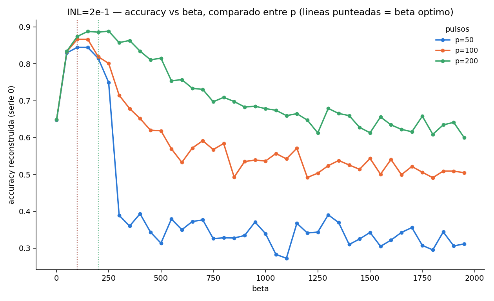
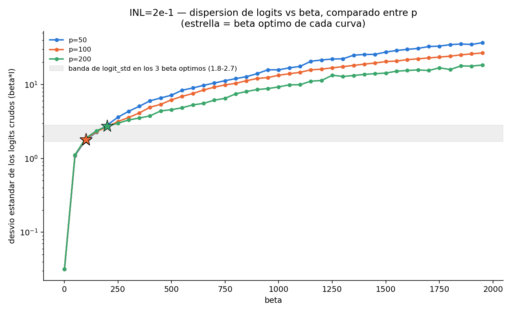
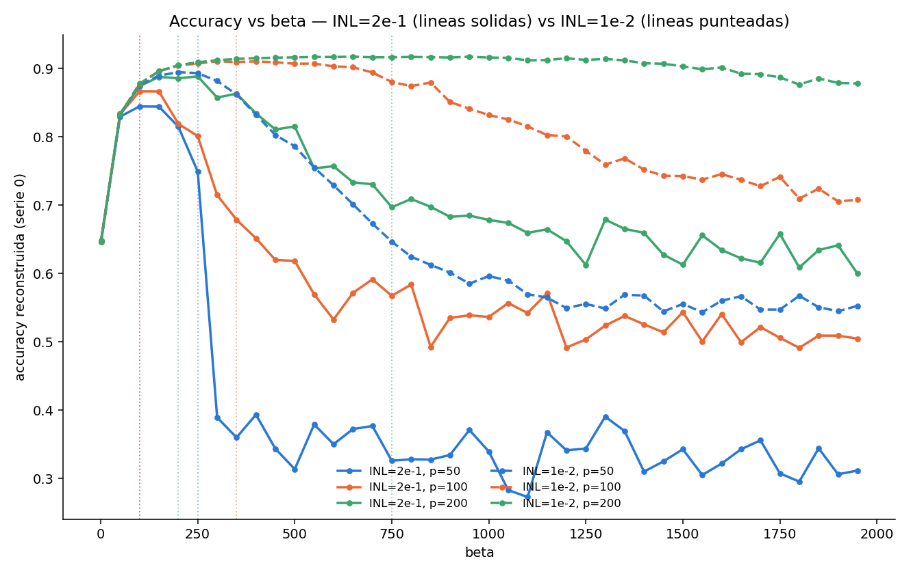
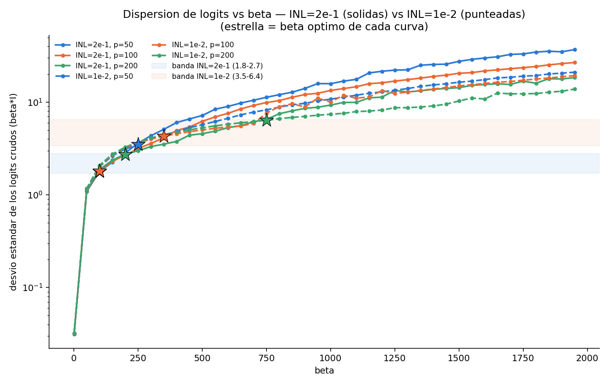

# Distribución de logits y softmax vs β — INL=2e-1 vs INL=1e-2, comparando p=50/100/200

Walter Quiñonez · Reporte generado con Claude Code · 7 de septiembre de 2026
(ampliado el mismo día con la Sección 7: extensión a INL=1e-2)

Continuación de `analisis_distribucion_softmax_INL_2e-1_p_50/`: se repite
exactamente el mismo análisis para `p=100` y `p=200` (misma curva `INL=2e-1`,
distinta cantidad de pulsos de la curva P/D) para responder la pregunta
original — ¿el β óptimo tiene algo particular en la distribución
softmax/logits, y es eso común entre distintos `p`?

**No se corrió ningún entrenamiento nuevo.** Todo sale de reconstruir,
a partir de los pesos ya guardados (`G_history_*.npz`), los logits `β·I`
que cada modelo ya entrenado produce sobre validación, para las 40 corridas
de β de cada una de las 3 grillas.

## 1. Método (idéntico al de `p=50`)

- Reconstrucción exacta (determinista, sin ruido): `forward_logits = β·(X @ (G⁺−G⁻))`.
- Serie 0, última época guardada (100, convergida). Los 5 folds de la serie
  0 cubren el dataset completo (60000 imágenes) y usan la misma partición
  en las 40 corridas de β de cada grilla (`particion_distinta_por_serie_reusada_entre_betas`).
- **Sanity check** (accuracy reconstruida vs. accuracy ya guardada del
  entrenamiento real): diferencia máxima `1.7×10⁻⁵` (p=100) y `1.7×10⁻⁵`
  (p=200) sobre las 40 corridas de cada grilla — igual de ajustado que en
  `p=50` (`3.3×10⁻⁵`).
- Scripts: [`analisis_distribucion_softmax_INL_2e-1_p_100/analizar_distribucion_softmax.py`](../analisis_distribucion_softmax_INL_2e-1_p_100/analizar_distribucion_softmax.py),
  [`..._p_200/analizar_distribucion_softmax.py`](../analisis_distribucion_softmax_INL_2e-1_p_200/analizar_distribucion_softmax.py),
  y [`comparar_p.py`](comparar_p.py) (este reporte, solo lee los 3 `resumen_por_beta.csv` ya generados).

β óptimo empírico de cada curva (`resumen_por_INL/resumen_optimos.csv`):
**p=50 → β\*=100 (84.79%)**, **p=100 → β\*=100 (86.57%)**, **p=200 → β\*=200 (88.96%)**.

## 2. Lo que NO es común entre p: la severidad del colapso post-óptimo

Las tres curvas suben de forma casi idéntica hasta su β óptimo (todas
arrancan en ~65% en β=1 y llegan a 84–89% en β≈100–200). La diferencia
grande aparece **después** del óptimo:

- **p=50**: colapso abrupto tipo acantilado. En 2 pasos de grilla (β: 200→300)
  la accuracy cae de 81.5% a 38.9%, y después queda oscilando sin
  tendencia entre 27% y 39% hasta β=1950 — un régimen básicamente roto.
- **p=100**: la caída es más gradual (81.9% en β=200 → 71.5% en β=300 →
  ~50–58% de "meseta ruidosa" desde β≈900 en adelante) — todavía se
  degrada mucho, pero sin el escalón brusco de p=50.
- **p=200**: la caída es **suave y casi monótona** — de 88.6% (β=200) baja
  progresivamente hasta ~60% en β=1950, sin ningún salto abrupto. Es, con
  diferencia, la más robusta a pasarse de β.

Es decir: **a mayor cantidad de pulsos (curva P/D más fina), la red se
vuelve más tolerante a un β excesivo** — más pulsos, además de mantener el
INL nominal, parecen actuar como una especie de regularización de la
dinámica de entrenamiento frente a un β grande. Esto también se ve en las
métricas de calibración: el ECE de p=50 da un salto brusco justo después
del acantilado (0.044→0.258 entre β=250 y 300), mientras que en p=100 y
p=200 el ECE post-óptimo sube de forma progresiva, sin escalón
(`analisis_distribucion_softmax_INL_2e-1_p_100/calibracion_vs_beta.png`,
`..._p_200/calibracion_vs_beta.png`).

## 3. Lo que SÍ parece común: el desvío estándar de los logits en el óptimo

Mirando el desvío estándar de los logits crudos (`β·I`, agregando las 10
salidas y las 60000 muestras) en el β óptimo de cada curva:

| p | β óptimo | accuracy | confianza media | entropía media | ECE | brecha confianza | **logit std** | frac. saturada |
|---:|---:|---:|---:|---:|---:|---:|---:|---:|
| 50 | 100 | 0.8446 | 0.617 | 1.213 | 0.227 | 0.269 | **1.78** | 0.000 |
| 100 | 100 | 0.8665 | 0.634 | 1.170 | 0.232 | 0.282 | **1.82** | 0.000 |
| 200 | 200 | 0.8858 | 0.744 | 0.821 | 0.142 | 0.307 | **2.74** | 0.001 |

(tabla completa: [`comparacion_en_beta_optimo.csv`](comparacion_en_beta_optimo.csv))

`p=50` y `p=100` tienen el **mismo** β óptimo (100) y dan un `logit_std`
casi idéntico (1.78 vs 1.82 — 2% de diferencia) a pesar de tener curvas P/D
de distinta resolución. `p=200` tiene β óptimo distinto (200, el doble) y
da `logit_std=2.74` — más alto, pero del mismo orden de magnitud, y sigue
cayendo muy lejos de los valores de saturación (`logit_std≥10`) que
aparecen en las 3 curvas bien pasado el óptimo. En las tres curvas, el
tramo "sano" (antes del colapso o de la degradación fuerte) corresponde a
`logit_std` en el rango aproximado **1.8–3.6** — la banda gris de la
figura marca justo el `logit_std` en los 3 β óptimos (1.8–2.7).

Esto es coherente con la lógica de `β_óptimo ~ κ/σ_I` de
`validacion_formula_beta_optimo/`: si κ es realmente ~O(1) e independiente
de la cantidad de pulsos, entonces el β que hace que `σ_I·β` (el
`logit_std` de esta tabla) caiga en ese rango angosto **es** el β óptimo —
y eso es exactamente lo que se ve acá, con la salvedad de que `logit_std`
en el óptimo real no es una constante perfecta sino que crece levemente
con p (1.78 → 1.82 → 2.74).

También son comunes, cualitativamente, la forma en U del ECE-vs-β (mínimo
un poco después del β óptimo, no exactamente en él) y el hecho de que la
separación de confianza correctos/incorrectos alcance su pico muy cerca
del β óptimo en las tres curvas (ver `calibracion_vs_beta.png` de cada
carpeta) — el β óptimo vive siempre pegado, pero no exactamente encima, del
punto de mejor calibración.

## 4. Interpretación

Para `INL=2e-1` (curva P/D muy no lineal), el β óptimo de cada `p` cae
siempre en la zona de la grilla donde:

1. el entrenamiento todavía converge de forma estable (antes del colapso
   o la fuerte degradación, cuya severidad SÍ depende mucho de `p`), y
2. el desvío estándar de los logits (`β·I`) está en un rango angosto de
   orden **1–3**, prácticamente el mismo entre `p=50` y `p=100` y solo
   moderadamente más alto en `p=200`.

O sea: el "qué tiene de particular" no está tanto en una propiedad exacta
del softmax en sí (ni el ECE, ni la confianza, ni la entropía tocan su
propio óptimo justo en β\*), sino en que β\* es el β más grande que todavía
mantiene la dispersión de los logits dentro de ese rango angosto — más
allá de él, la dinámica de entrenamiento (β actúa multiplicando también el
gradiente) se degrada, con velocidad muy distinta según cuántos pulsos
tenga la curva P/D.

## 5. Próximos pasos (planteados en la primera versión de este reporte)

Falta repetir este mismo análisis para los `INL` más chicos (curvas P/D
casi lineales: `1e-2`, `1e-4`, etc., donde el grid-search
`accuracy_vs_beta_INL_*.png` ya sugiere picos mucho más suaves, sin
acantilado) para ver si:

- el rango de `logit_std` en el β óptimo se mantiene parecido (¿1–3
  también?, ¿o depende del INL?), y
- el "acantilado de estabilidad" es un fenómeno específico de curvas P/D
  muy no lineales (`INL` grande), o aparece también, más atenuado, en
  curvas casi lineales.

**Esto es exactamente lo que se responde en la Sección 7**, repitiendo el
análisis para `INL=1e-2` (curva casi lineal) con los mismos `p=50/100/200`.

## 6. Archivos generados (Secciones 1–5, sobre INL=2e-1)

- [`comparar_p.py`](comparar_p.py) — script de esta comparación (solo lee los 3 `resumen_por_beta.csv` ya generados por `p=50/100/200`).
- [`comparacion_en_beta_optimo.csv`](comparacion_en_beta_optimo.csv) — tabla de la Sección 3.
- `accuracy_vs_beta_comparado.png`, `logit_std_vs_beta_comparado.png`.
- Por cada `p` (carpetas [`p_50`](../analisis_distribucion_softmax_INL_2e-1_p_50/), [`p_100`](../analisis_distribucion_softmax_INL_2e-1_p_100/), [`p_200`](../analisis_distribucion_softmax_INL_2e-1_p_200/)): `analizar_distribucion_softmax.py`, `resumen_por_beta.csv`, `distribuciones_representativas.npz`, y 6 figuras cada una (accuracy, confianza/entropía, calibración, histogramas de confianza y de logits, diagramas de reliability).
- `reporte_distribucion_softmax_INL_2e-1.pdf` / `.tex` — este reporte en PDF.

---

## 7. Ampliación: ¿es esto propio de INL=2e-1, o aparece también en curvas casi lineales?

Se repitió exactamente el mismo análisis (mismo método, misma serie 0,
misma última época) para `INL=1e-2` — una curva P/D casi lineal, dos
órdenes de magnitud menos no lineal que `2e-1` — con los mismos
`p=50/100/200`. Sanity check igual de ajustado: diferencia máxima
`1.7×10⁻⁵` (p=50), `1.7×10⁻⁵` (p=100) y `9.4×10⁻⁸` (p=200) entre accuracy
reconstruida y guardada. β óptimo empírico: **p=50→β\*=250 (89.47%)**,
**p=100→β\*=350 (90.91%)**, **p=200→β\*=750 (91.63%)**.

Scripts: [`analisis_distribucion_softmax_INL_1e-2_p_50/`](../analisis_distribucion_softmax_INL_1e-2_p_50/),
[`..._p_100/`](../analisis_distribucion_softmax_INL_1e-2_p_100/),
[`..._p_200/`](../analisis_distribucion_softmax_INL_1e-2_p_200/), y
[`comparar_INL.py`](comparar_INL.py) (esta sección, solo lee los 6
`resumen_por_beta.csv` ya generados).

### 7.1 Respuesta (a): el acantilado SÍ es propio de INL grande (muy no lineal)

La diferencia es enorme y confirma la sospecha de la Sección 5:

- **`INL=1e-2, p=50`**: baja de forma *suave*, sin ningún escalón — de
  89.3% en β\*=250 a ~55% recién en β=1950 (mucho más gradual que su
  contraparte `INL=2e-1, p=50`, que colapsaba a 30-39% ya en β=300).
- **`INL=1e-2, p=100`**: se mantiene por encima de 90% hasta β≈650, y baja
  gradualmente hasta ~70% en β=1950 — sin ningún salto abrupto.
- **`INL=1e-2, p=200`**: prácticamente **una meseta**. Se mantiene entre
  90.3% y 91.7% desde β=200 hasta β≈1400, y termina en 87.8% en β=1950 —
  la accuracy casi no se resiente en todo el rango de la grilla. Es, con
  diferencia, la curva más robusta de las 6 analizadas hasta ahora.

O sea: **el "acantilado de estabilidad" no es un fenómeno general del
sistema — es específico de curvas P/D muy no lineales (`INL` grande)**.
Con `INL` chico (curva casi lineal), aumentar β mucho más allá del óptimo
degrada la accuracy de forma suave y acotada, en vez de romper el
entrenamiento.

### 7.2 Respuesta (b): el `logit_std` en el óptimo NO es universal — depende del INL

| INL | p | β óptimo | accuracy | ECE | **logit std** | frac. saturada |
|---:|---:|---:|---:|---:|---:|---:|
| 2e-1 | 50 | 100 | 0.8446 | 0.227 | **1.78** | 0.000 |
| 2e-1 | 100 | 100 | 0.8665 | 0.232 | **1.82** | 0.000 |
| 2e-1 | 200 | 200 | 0.8858 | 0.142 | **2.74** | 0.001 |
| 1e-2 | 50 | 250 | 0.8932 | 0.085 | **3.49** | 0.014 |
| 1e-2 | 100 | 350 | 0.9096 | 0.059 | **4.28** | 0.032 |
| 1e-2 | 200 | 750 | 0.9166 | 0.031 | **6.37** | 0.078 |

(tabla completa: [`comparacion_en_beta_optimo_INL_y_p.csv`](comparacion_en_beta_optimo_INL_y_p.csv))

La hipótesis de la Sección 4 (banda universal `logit_std≈1.8–2.7`) **no se
sostiene entre INL distintos**: para `INL=1e-2` el `logit_std` en el
óptimo es 2–3 veces más alto (3.5–6.4) que para `INL=2e-1` (1.8–2.7), y las
dos bandas ni siquiera se tocan en la Figura de arriba. Lo que sí se
sostiene, y se refuerza con este segundo INL, es la parte más modesta de
la hipótesis: **dentro de un mismo INL, el `logit_std` en el β óptimo
queda en un rango angosto y crece solo levemente con `p`** (`INL=2e-1`:
1.78→1.82→2.74; `INL=1e-2`: 3.49→4.28→6.37 — mismo orden de crecimiento
relativo con `p` en ambos casos, ×1.5–1.8 de `p=50` a `p=200`).

También es consistente entre ambos INL que la fracción de softmax saturado
en el propio β óptimo, aunque nunca despreciable para `INL=1e-2`
(1.4–7.8%), se mantiene muy por debajo de los valores >15-20% que aparecen
bien pasado el óptimo en ambas curvas.

### 7.3 Interpretación revisada

El resultado de la Sección 4 ("β óptimo ≈ el β más grande que mantiene
`logit_std` en 1.8–2.7") era, en realidad, una propiedad de `INL=2e-1`
específicamente, no una constante universal. La versión corregida:

- Dentro de una misma curva P/D (mismo `INL`), el `logit_std` óptimo es
  aproximadamente estable entre distintos `p` — la fórmula
  `β_óptimo∼κ/σ_I` con `κ` fijo parece describir razonablemente bien la
  variación **con `p`, a `INL` fijo**.
- Pero `κ` (o el `logit_std` óptimo efectivo) **sí depende del `INL`**: una
  curva P/D más lineal (INL chico) tolera un `logit_std` óptimo más alto
  que una muy no lineal (INL grande). Tiene sentido cualitativamente: con
  `INL` chico los pesos `G⁺−G⁻` están más concentrados/uniformes, así que
  la suma `I=ΣW_ijV_j` es una variable más "bien portada" (más cerca del
  régimen gaussiano ideal de CLT que asume la fórmula), y tolera un β
  mayor antes de que la dinámica de entrenamiento se degrade.
- La severidad de la degradación post-óptimo (el acantilado) también
  depende fuertemente del `INL`: brusca y catastrófica en `INL=2e-1`,
  ausente o casi ausente en `INL=1e-2`.

### 7.4 Próximos pasos (actualizado)

- Confirmar la tendencia con un tercer punto de `INL` (por ejemplo `1e-4`
  o `1e-5`, curvas P/D aún más lineales, ya con data disponible en
  `data_beta_grid_search_SP/`) para ver si el `logit_std` óptimo sigue
  subiendo al bajar el INL, y si se puede ajustar una relación funcional
  simple `logit_std_óptimo(INL)`.
- Extender la comparación de "severidad del acantilado" a los INL de la
  zona de transición (`7e-2`, `1e-1`, `1.3e-1`, `1.6e-1`, ver
  `train_job_INL_7e-2_p_50.sh` y afines — datos aún no generados/bajados)
  para ver en qué punto exacto del rango de INL aparece el acantilado.

## 8. Archivos generados (todo el reporte, actualizado)

- Sección 1–5 (solo `INL=2e-1`): ver Sección 6.
- Sección 7 (`INL=1e-2`): carpetas [`analisis_distribucion_softmax_INL_1e-2_p_50`](../analisis_distribucion_softmax_INL_1e-2_p_50/),
  [`..._p_100`](../analisis_distribucion_softmax_INL_1e-2_p_100/),
  [`..._p_200`](../analisis_distribucion_softmax_INL_1e-2_p_200/) (mismo
  contenido que sus análogas de `INL=2e-1`), y en esta carpeta:
  [`comparar_INL.py`](comparar_INL.py), [`comparacion_en_beta_optimo_INL_y_p.csv`](comparacion_en_beta_optimo_INL_y_p.csv),
  `accuracy_vs_beta_comparado_INL_y_p.png`, `logit_std_vs_beta_comparado_INL_y_p.png`.
- `reporte_distribucion_softmax_INL_2e-1.pdf` / `.tex` — este reporte completo (Secciones 1–8) en PDF.
