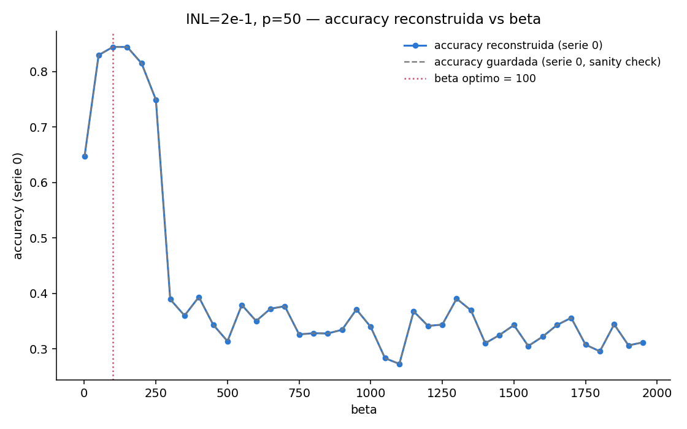
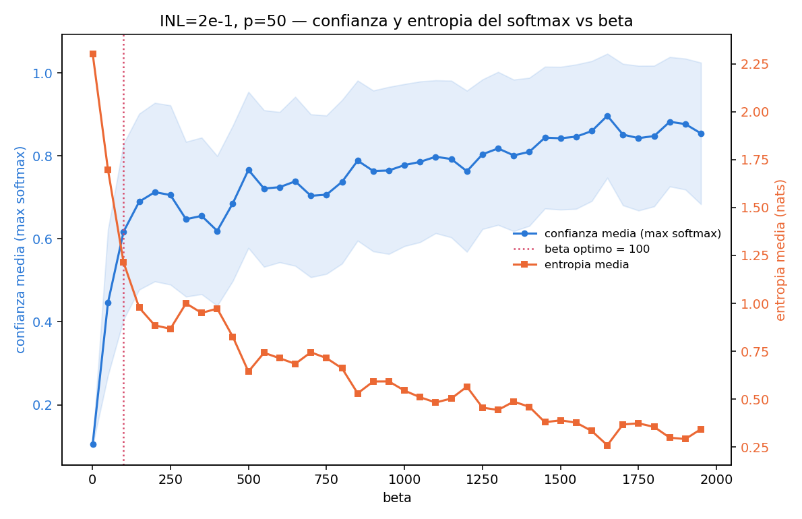
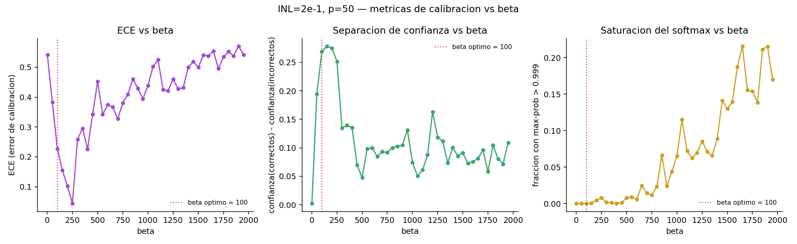
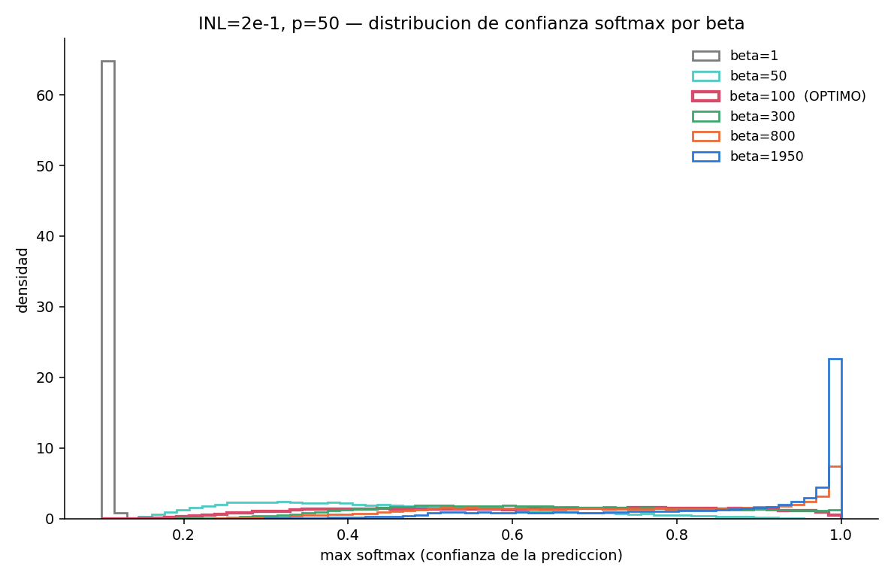
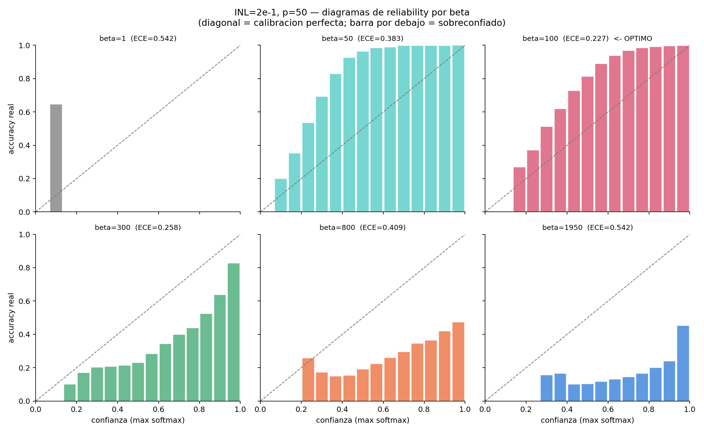
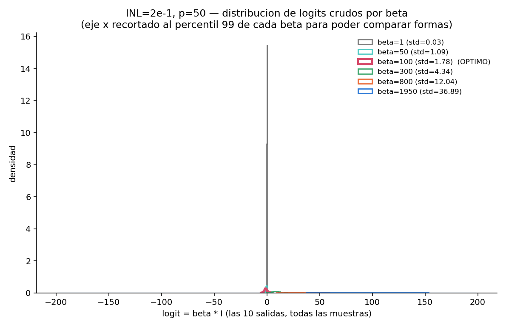

# Distribución de logits y softmax vs β — INL=2e-1, p=50

Walter Quiñonez · Reporte generado con Claude Code · 7 de septiembre de 2026

Pedido: tomar la data ya generada para `INL=2e-1` (curva P/D muy no lineal),
analizar la distribución de los logits que salen de la softmax para
distintos β (por ahora solo `p=50`), y ver si el β óptimo tiene algo
particular en esa distribución, o al menos algo que sirva de referencia
para comparar más adelante contra otros `p` e `INL`.

**No se corrió ningún entrenamiento nuevo.** Todo lo de este reporte sale de
reconstruir, a partir de los pesos ya guardados
(`data_beta_grid_search_SP/beta_grid_search_SP_INL_2e-1_p_50/G_history_*.npz`),
los logits `β·I` que el modelo ya entrenado produce sobre el set de
validación, para las 40 corridas de β de esa grilla.

## 1. Método

Script: [`analizar_distribucion_softmax.py`](analizar_distribucion_softmax.py).

- **Reconstrucción exacta** (mismo método que
  `reconstruccion_logits_val_INL_1e-2_p_100_beta1/reconstruir_logits_val.py`):
  `forward()` de `MemDNN` es determinista (`I = X @ (G⁺ − G⁻)`, sin ruido —
  esta grilla tiene `ruido=0%`), así que basta con el `G_history` guardado
  para reproducir los logits exactos, sin reentrenar nada.
- Se usa la **serie 0** y la **última época guardada** (época 100, modelo
  convergido) de cada una de las 40 corridas de β. El modo de esta grilla es
  `"particion_distinta_por_serie_reusada_entre_betas"`: la serie 0 usa **la
  misma partición KFold** en las 40 corridas, así que los 40 sets de
  validación reconstruidos son directamente comparables entre sí.
- Los 5 folds de una serie no se solapan y cubren el dataset completo, así
  que agregar los 5 folds da la distribución softmax sobre **las 60000
  imágenes de MNIST**, para cada β.
- Para cada β: `logits = β·I` (reconstruidos), `probs = softmax(logits)`,
  y de ahí: accuracy, confianza (`max(probs)` por muestra), entropía,
  separación de confianza entre aciertos/errores, ECE (*expected calibration
  error*, 15 bins) y fracción de muestras "saturadas" (`max(probs) > 0.999`).

**Sanity check**: la accuracy reconstruida coincide con la accuracy ya
guardada en su momento durante el entrenamiento real, con una diferencia
máxima de `3.3×10⁻⁵` sobre las 40 corridas (ver consola / `resumen_por_beta.csv`,
columnas `acc_reconstruida` vs `acc_guardada`) — la reconstrucción es
correcta.

## 2. Resultado principal: un "acantilado" de estabilidad, no solo un pico

La curva accuracy-vs-β para `INL=2e-1, p=50` no es un pico suave: sube de
64.7% (β=1) a un máximo de **84.5% en β=100–150**, se mantiene alta hasta
β≈200 (81.5%) y **colapsa** a partir de β≈250–300 (74.9% → 38.9%), quedando
después oscilando sin tendencia clara entre 27% y 39% hasta β=1950 (el
grid-search completo, con 20 series × 5 folds, ya mostraba este mismo perfil
en `data_beta_grid_search_SP/resumen_por_INL/accuracy_vs_beta_INL_2e-1.png`;
acá se confirma que el colapso no es ruido de una sola serie: aparece igual
de nítido en la serie 0 sola).

β óptimo empírico (grid completo) = **100**, con 84.79% de accuracy.

## 3. Qué le pasa a la softmax mientras tanto: sobreconfianza que crece sin parar

Acá está lo interesante: la **confianza media del softmax crece de forma
monótona con β** (0.11 → 0.45 → 0.62 → 0.71 → ... → 0.85), sin ninguna señal
del colapso de accuracy en β≈300. La red seguiría "creyendo" cada vez más en
sus propias predicciones aunque, a partir de β≈300, la mayoría de esas
predicciones ya son incorrectas. Esto es sobreconfianza en su forma más
extrema: el softmax se satura (hasta 22% de las muestras con
probabilidad>0.999 en β≈1650) mientras la accuracy real ronda el 30%.

| β | accuracy | confianza media | entropía media | logit std | ECE | conf(correctos)−conf(incorrectos) |
|---:|---:|---:|---:|---:|---:|---:|
| 1 | 0.647 | 0.106 | 2.302 | 0.03 | 0.542 | 0.002 |
| 50 | 0.830 | 0.446 | 1.697 | 1.09 | 0.383 | 0.195 |
| **100 (óptimo)** | **0.845** | **0.617** | **1.213** | **1.78** | **0.227** | **0.269** |
| 150 | 0.844 | 0.690 | 0.977 | 2.26 | 0.155 | 0.278 |
| 200 | 0.815 | 0.713 | 0.885 | 2.83 | 0.102 | 0.275 |
| 250 | 0.749 | 0.706 | 0.867 | 3.61 | **0.044** | 0.252 |
| 300 | 0.389 | 0.647 | 1.000 | 4.34 | 0.258 | 0.135 |
| 500 | 0.314 | 0.766 | 0.644 | 7.18 | 0.453 | 0.047 |
| 800 | 0.328 | 0.738 | 0.661 | 12.04 | 0.409 | 0.100 |
| 1950 | 0.312 | 0.854 | 0.344 | 36.89 | 0.542 | 0.109 |

(tabla completa: [`resumen_por_beta.csv`](resumen_por_beta.csv))

## 4. Lo que tiene de particular la zona del β óptimo

Los tres paneles (ECE, separación de confianza correctos/incorrectos,
fracción saturada) muestran el mismo patrón: **β=100 no es el punto exacto
de mejor calibración, pero está sentado justo en el borde del único tramo
"sano" de toda la grilla** (β≈100–250):

- El **ECE mínimo real es en β≈250** (0.044), no en β=100 (0.227) — ahí el
  modelo predice con una confianza que en promedio coincide con su accuracy
  real. Pero β=250 ya perdió 10 puntos de accuracy frente al óptimo (74.9%
  vs 84.5%) porque está más cerca del acantilado.
- La **separación de confianza** (cuánto más seguro está el modelo cuando
  acierta que cuando se equivoca — una medida de si la confianza es *útil*)
  tiene su pico en β≈150–200 (~0.28), con β=100 muy cerca (0.269). Después
  del acantilado (β≥300) esa separación cae a la mitad o menos: el modelo
  ya no distingue bien, con su confianza, entre lo que sabe y lo que no.
- La **fracción de softmax saturado** es prácticamente cero (`<0.1%`) en
  todo el tramo β≤250, y crece sostenidamente después — el óptimo vive
  enteramente en el régimen "sin saturar".
- El **std de los logits crudos** (`β·I`) en el óptimo es **1.78**, subiendo
  a ~2.3–3.6 en el resto del tramo sano (β=150–250) y disparándose a
  4–37 después del acantilado. Es decir: el tramo sano completo corresponde
  a que el argumento de la softmax tenga un desvío estándar de **orden 1–4**
  — ni tan chico que la softmax sea casi uniforme (β=1: std=0.03, accuracy
  64.7%) ni tan grande que sature (β≥800: std>12, saturación >2%).

Los histogramas de confianza por muestra lo hacen visual: en β=1 casi toda
la masa está pegada a 0.1 (softmax prácticamente uniforme, 10 clases). En
β=100 (óptimo) la distribución ya se separó bastante de ese pico uniforme
pero sigue teniendo masa apreciable en confianzas intermedias (0.3–0.7) —
no se volcó de golpe hacia 1. En β=300 y sobre todo β=1950, la distribución
se concentra fuertemente cerca de 1 (el modelo estampa una etiqueta con
altísima confianza en casi todas las muestras) — pero, como ya vimos, con
mucha menor accuracy real detrás.

Los diagramas de *reliability* (accuracy real por bin de confianza, contra
la diagonal de calibración perfecta) muestran la misma historia desde otro
ángulo: β=1 y β=50 son **subconfiados** (las barras quedan por encima de la
diagonal — el modelo acierta más de lo que su propia confianza sugiere);
β=100 es el que queda **más cerca de la diagonal en las confianzas altas**
sin llegar a cruzarla hacia el lado sobreconfiado; de β=300 en adelante las
barras caen sistemáticamente **por debajo** de la diagonal — sobreconfianza
clásica, y cada vez peor.

## 5. Interpretación

Para esta curva (`INL=2e-1`, muy no lineal, `p=50`), el β óptimo **no
maximiza ninguna métrica de calidad del softmax por separado** (ni
confianza, ni entropía, ni ECE, ni separación de confianza tocan su óptimo
exactamente en β=100). Lo que sí ocurre es que β=100 cae **dentro del único
tramo de la grilla donde el entrenamiento converge de forma estable**
(β≲250), muy cerca de donde la mayoría de esas métricas de calidad del
softmax alcanzan sus propios óptimos (β≈150–250). Más allá de ese tramo, el
entrenamiento entra en un régimen inestable — probablemente porque β
multiplica también el gradiente de la loss respecto a `I` (actúa como un
factor extra sobre el *learning rate* efectivo), y con `a_pot=a_dep=5.85`
(curva P/D muy abrupta, alto INL) ese régimen se vuelve inmanejable a partir
de cierto β: la red sigue "aprendiendo" a estar cada vez más segura de sí
misma, pero deja de aprender a acertar.

La señal más reproducible y concreta para comparar más adelante contra
otros `p` / `INL` es el **std de los logits crudos** (`β·I`) en el β óptimo:
acá da **≈1.8**, y el tramo sano completo (antes del colapso) va de
**≈0.03 (β=1) a ≈3.6 (β=250, borde del colapso)** — es decir, el β óptimo
corresponde a un régimen donde el argumento de la softmax tiene un desvío
estándar chico pero ya lejos de cero (orden 1), consistente con la lógica
de la fórmula analítica de β óptimo ya explorada en
`validacion_formula_beta_optimo/` (`β_óptimo ~ κ / (σ_I)`, con κ de orden
unidad). Falta ver si ese "std≈1–2" se mantiene al mirar `p=100`, `p=200`
y los `INL` más chicos (curvas P/D casi lineales, sin este acantilado tan
marcado) — es el próximo paso natural.

## 6. Archivos generados

- [`analizar_distribucion_softmax.py`](analizar_distribucion_softmax.py) — script, reproducible.
- [`resumen_por_beta.csv`](resumen_por_beta.csv) — una fila por β (40 filas), todas las métricas de la Sección 3.
- `distribuciones_representativas.npz` — confianza/entropía/logits/aciertos crudos para β=1,50,100,300,800,1950 (para rehacer las figuras sin recomputar todo).
- `accuracy_vs_beta_reconstruida.png`, `confianza_entropia_vs_beta.png`, `calibracion_vs_beta.png`, `histogramas_maxprob.png`, `histogramas_logits.png`, `diagramas_reliability.png`.
