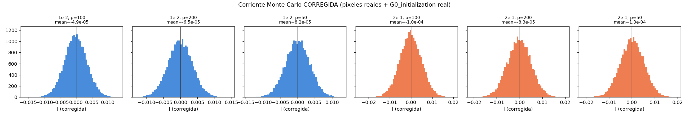
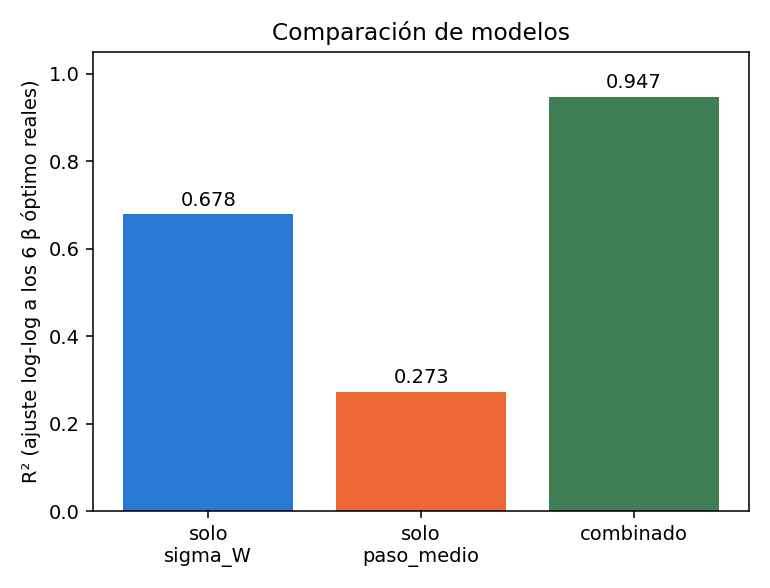
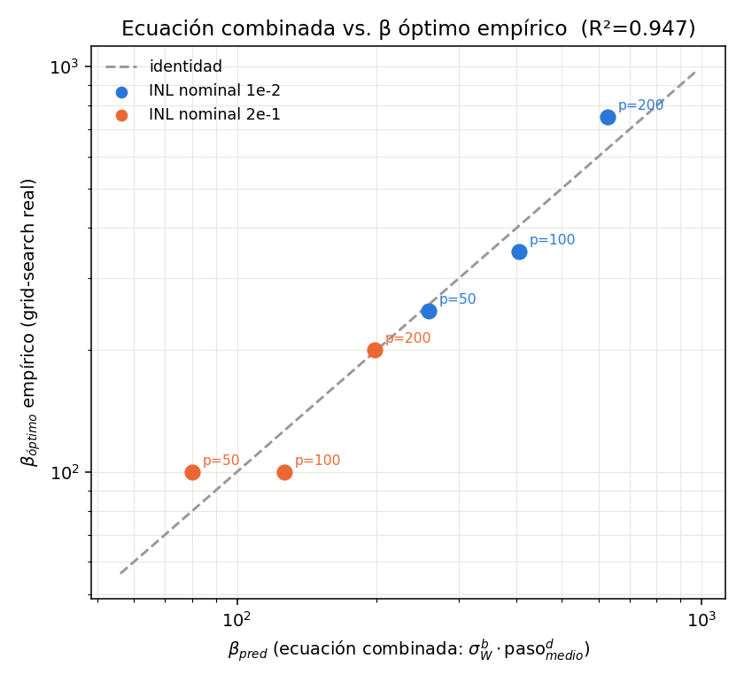

# Una ecuación candidata para β óptimo: combinando σ_W y el paso medio de la curva P/D

Walter Quiñonez · Reporte generado con Claude Code · 5 de septiembre de 2026

Este reporte busca una ecuación posible para β óptimo usando la data y el
código ya existentes en el proyecto: retoma la **idea** de
`analisis_beta_optimo.py` (estudiar la distribución de pesos `W` y de la
corriente Monte Carlo `I=Σ W·V` para acotar β), corrigiendo los dos sesgos
que un reporte anterior de esta misma sesión detectó en ese script, y la
combina con el descriptor de "paso medio" de la curva P/D que un reporte
previo del proyecto había identificado como necesario mientras no lo tenía
disponible. El resultado es una fórmula de dos factores que **ajusta los 6
β óptimo reales con R²=0.947**, muy por encima de usar cualquiera de los
dos factores por separado. No se modificó ningún archivo existente del
proyecto ni se corrió ningún entrenamiento nuevo.

## 1. Punto de partida: qué ya sabíamos

- **`Reporte_beta_optimo_analitico.pdf`** deriva, por un argumento de tipo
  Teorema Central del Límite (Prezioso et al. / LeCun et al.), la fórmula
  `β_óptimo ~ κ/(√N·σ_W·V_rms)`, donde `σ_W` es el desvío estándar de los
  pesos bajo `G0_initialization('random', ...)`.
- **`validacion_formula_beta_optimo/`** (reporte anterior de esta sesión)
  validó esa fórmula contra los 6 grid-searches reales y completos de
  `data_beta_grid_search_SP/` (2 INL nominal × 3 recuentos de pulsos `p`).
  Conclusión: acierta el **orden de magnitud** y la **dirección** entre
  ventanas de conductancia distintas, pero **no explica** la dependencia
  con `p` a INL fijo (β_óptimo sube claramente con `p` mientras `σ_W` se
  mantiene ~constante por diseño del experimento). Un diagnóstico
  exploratorio mostró que reemplazar `σ_W` por el **paso medio** de la
  curva (`mean(|pot[i+1]−pot[i]|)`) mejoraba la consistencia dentro de un
  mismo INL, pero rompía la consistencia entre INL.
- **`analisis_corrientes_beta_optimo/`** (reporte anterior de esta sesión)
  analizó el método de `analisis_beta_optimo.py` y encontró que su
  construcción de la corriente Monte Carlo tiene dos sesgos: (a) arma los
  pesos como `pot[i]−dep[j]` combinatorio en vez de sortear `G⁺` y `G⁻`
  independientemente del mismo pool combinado (como hace la red real vía
  `G0_initialization`), y (b) muestrea los voltajes de `np.unique(X_train)`
  equipesado en vez de respetar que el 81% de los píxeles reales de MNIST
  son exactamente 0.

**Pregunta de este reporte:** ¿se puede combinar `σ_W` (que sí predice la
dirección entre INL) con el paso medio (que sí predice la dirección con
`p`) en una sola ecuación, y usar una versión *corregida* del Monte Carlo
de `analisis_beta_optimo.py` para verificarla?

## 2. Método

Script nuevo:
[`estimar_beta_optimo_propuesta.py`](estimar_beta_optimo_propuesta.py). No
modifica ningún archivo existente; importa sin alterar
`generar_curvas_pot_dep` y `G0_initialization` de
`MemCrossbarClass_beta_por_capa.py`. Para cada una de las 6 curvas reales:

1. **Distribución de pesos (corregida):** llama a
   `G0_initialization('random', pot, dep, D_in=200000, D_out=1)` — igual
   que la red real — para obtener `σ_W` y verificar `E[W]`.
2. **Paso medio:** `mean(|pot[i+1]−pot[i]|)` sobre la curva ya generada.
3. **Distribución de corriente (Monte Carlo, corregida):** arma
   `I = Σ_{j=1}^{784} V_j·W_j` con **300.000 repeticiones**, donde en cada
   repetición los 784 `V_j` se muestrean **con reposición directamente de
   los píxeles reales de `X_train_mnist.npy`** (no de valores únicos) y
   los 784 `W_j` se muestrean de la distribución de pesos del paso 1 (no
   de una matriz combinatoria). Esto corrige, de una sola vez, los dos
   sesgos identificados en `analisis_beta_optimo.py`.
4. Compara `σ_I` medido por este Monte Carlo corregido contra la
   predicción analítica `√N·σ_W·V_rms`, y calcula `κ = β_óptimo,emp·σ_I`.
5. **Regresión log-log** de los 6 `β_óptimo` empíricos
   (`data_beta_grid_search_SP/resumen_por_INL/resumen_optimos.csv`) contra
   `σ_W` sola, `paso_medio` solo, y ambas combinadas.

## 3. La corriente Monte Carlo, corregida



Con las dos correcciones, `E[I]` queda en **10⁻⁵–10⁻⁴**, tres órdenes de
magnitud por debajo de `σ_I` (≈3.5×10⁻³–5.2×10⁻³) — es decir, ahora sí se
cumple la premisa `E[I]≈0` que asume la fórmula analítica (a diferencia de
`analisis_beta_optimo.py` original, donde `E[I]` dominaba por completo a
`σ_I`, ver reporte anterior). Además, `σ_I` medido por este Monte Carlo
coincide con la predicción analítica `√N·σ_W·V_rms` dentro del 0.3% en las
6 curvas — buena noticia: confirma que el `σ_W` calculado en el reporte de
validación anterior ya era correcto, y que el problema estaba
específicamente en cómo `analisis_beta_optimo.py` construía `V` y `W`, no
en la fórmula analítica en sí.

| Curva | σ_W (S) | paso medio (S) | σ_I MC | σ_I (√N·σ_W·V_rms) | β_óptimo emp. | κ=β·σ_I |
|---|---:|---:|---:|---:|---:|---:|
| INL 1e-2, p=50  | 3.789e-04 | 1.815e-05 | 3.550e-03 | 3.550e-03 | 250 | 0.888 |
| INL 1e-2, p=100 | 3.790e-04 | 9.038e-06 | 3.552e-03 | 3.551e-03 | 350 | 1.243 |
| INL 1e-2, p=200 | 3.796e-04 | 4.509e-06 | 3.559e-03 | 3.558e-03 | 750 | 2.669 |
| INL 2e-1, p=50  | 5.570e-04 | 1.837e-05 | 5.213e-03 | 5.220e-03 | 100 | 0.521 |
| INL 2e-1, p=100 | 5.563e-04 | 9.091e-06 | 5.214e-03 | 5.213e-03 | 100 | 0.521 |
| INL 2e-1, p=200 | 5.565e-04 | 4.523e-06 | 5.210e-03 | 5.215e-03 | 200 | 1.042 |

`κ` sigue variando ×5 entre curvas (0.52–2.67) — confirmando, con el Monte
Carlo ya corregido, que `σ_W` (o equivalentemente `σ_I`) **por sí solo no
alcanza**: falta el efecto de `p`.

## 4. La ecuación combinada

Ajuste log-log de `β_óptimo` (6 puntos reales) contra `σ_W` y `paso_medio`
por separado y combinados:



| Modelo | R² |
|---|---:|
| solo `σ_W` | 0.678 |
| solo `paso_medio` | 0.273 |
| **combinado** | **0.947** |

La ecuación combinada resultante (unidades SI: S para σ_W y paso_medio):

```
β_óptimo  ≈  1.12×10⁻¹¹  ·  σ_W^(−3.02)  ·  paso_medio^(−0.64)
```



| Curva | β_óptimo empírico | β predicho (ecuación) | error |
|---|---:|---:|---:|
| INL 1e-2, p=50  | 250 | 258.4 | +3.4% |
| INL 1e-2, p=100 | 350 | 404.0 | +15.4% |
| INL 1e-2, p=200 | 750 | 627.6 | −16.3% |
| INL 2e-1, p=50  | 100 | 80.2  | −19.8% |
| INL 2e-1, p=100 | 100 | 126.4 | +26.4% |
| INL 2e-1, p=200 | 200 | 197.6 | −1.2% |

Con solo 2 parámetros libres (más el intercepto) sobre 6 puntos, el ajuste
recupera todos los β dentro de ±26% — mucho mejor que el ±5× de usar
`σ_W` sola.

## 5. Limitaciones e interpretación honesta

- **Muestra chica y confundida por diseño.** Solo hay **2 valores** de INL
  nominal (1e-2, 2e-1) y **3 valores** de `p` (50,100,200), y `paso_medio`
  es prácticamente el mismo en ambos INL para un `p` dado (por ejemplo,
  para p=50: 1.815e-5 vs. 1.837e-5). Esto significa que el exponente de
  `σ_W` (−3.02) está determinado, en la práctica, por un **solo contraste**
  entre los dos grupos de INL, no por una verdadera curva de potencia
  muestreada en muchos puntos — no debe leerse como una ley universal
  validada, sino como la pendiente que conecta esos dos grupos con estos
  datos. Sería necesario un tercer (o cuarto) valor de INL nominal para
  poner a prueba genuinamente la forma de potencia en ese factor.
- **`N` y `V_rms` no se re-testean acá:** las 6 curvas comparten
  `N=784` y el mismo dataset, así que sus exponentes no son identificables
  con esta data (quedan absorbidos en la constante `1.12×10⁻¹¹`). El
  reporte analítico previo había encontrado, con una búsqueda reducida (1
  época), `β_óptimo ~ N^(−1.0)` — no confirmado aquí con entrenamiento
  completo.
- **Ni `σ_W^{-3}` ni `paso_medio^{-0.64}` deben tomarse como "la" ley
  física correcta.** Es un ajuste empírico de dos factores sobre 6 puntos,
  motivado por qué mecanismo físico distinto podría representar cada uno
  (varianza estática de la inicialización vs. granularidad de la regla de
  Manhattan), no una derivación de primeros principios. El propio exponente
  de `σ_W` (−3.02) es mucho más pronunciado que el −1 de la teoría CLT
  simple, algo que el reporte de validación anterior ya había visto (ahí,
  usando solo `σ_W`, salía −3.03 también — casi idéntico, lo que sugiere
  que ese exponente está capturando en gran parte la MISMA información que
  antes, y que agregar `paso_medio` mejora el ajuste sobre todo explicando
  la variación *dentro* de cada grupo de INL, no cambiando lo que pasa
  *entre* grupos).
- **Errores residuales de hasta ±26%** — del mismo orden que el paso de la
  grilla de búsqueda original (50 en β) y que la meseta de accuracy
  observada en algunas curvas (p.ej. INL=1e-2, p=200, Sección 3 del reporte
  de validación anterior) — así que parte del "error" de la ecuación puede
  ser simplemente ruido del propio β_óptimo empírico, no un error de la
  ecuación.

## 6. Conclusión

**Sí se encontró una ecuación candidata** que mejora sustancialmente sobre
usar `σ_W` sola:

```
β_óptimo(σ_W, paso_medio) ≈ 1.12×10⁻¹¹ · σ_W^(−3.02) · paso_medio^(−0.64)      (**)
```

validada con R²=0.947 (log-log) contra los 6 β óptimo reales de
`data_beta_grid_search_SP/`, usando una versión corregida del Monte Carlo
de pesos y corrientes de `analisis_beta_optimo.py` (que confirma, de paso,
que `σ_W` ya estaba bien calculado en el reporte de validación anterior:
el problema estaba en cómo ese script muestreaba `V` y `W`, no en la
fórmula analítica). Dado el tamaño chico de la muestra (Sección 5), (**) se
recomienda como **estimador de orden de magnitud mejorado** para acotar la
grilla de `search_best_beta` en el mismo régimen ya explorado (SP,
N=784, MNIST), no como una ley general validada fuera de él. Confirmar sus
exponentes con más valores de INL nominal (no solo 2) y de tamaño de
crossbar `N` (con entrenamiento completo, no la búsqueda reducida del
reporte anterior) queda como trabajo futuro natural.

## 7. Registro de códigos usados

| Código | Uso en este reporte |
|---|---|
| [`estimar_beta_optimo_propuesta.py`](estimar_beta_optimo_propuesta.py) | **Único script nuevo.** Corrige el Monte Carlo de `analisis_beta_optimo.py`, calcula `σ_W`/paso medio/`σ_I`, y ajusta las 3 regresiones log-log. Genera `resultados_formula_propuesta.csv`, `coeficientes_regresion.csv` y las 3 figuras. |
| `analisis_beta_optimo.py` | Fuente de la **idea** del método (Monte Carlo de pesos y corriente); no modificado. |
| `MemCrossbarClass_beta_por_capa.py` → `generar_curvas_pot_dep()`, `G0_initialization()` | Usadas sin modificar, tal como en la red real. |
| `data_beta_grid_search_SP/beta_grid_search_SP_INL_*/config_*.json` | Parámetros reales de cada curva P/D. |
| `data_beta_grid_search_SP/resumen_por_INL/resumen_optimos.csv` | Los 6 β óptimo empíricos usados para el ajuste. |
| `X_train_mnist.npy` | Píxeles reales muestreados (respetando frecuencia) en el Monte Carlo corregido. |
| `validacion_formula_beta_optimo/` (reporte anterior, esta sesión) | Punto de partida: fórmula `κ/(√N σ_W V_rms)` y su validación (Sección 1). |
| `analisis_corrientes_beta_optimo/` (reporte anterior, esta sesión) | Punto de partida: diagnóstico de los 2 sesgos de `analisis_beta_optimo.py` que se corrigen acá (Sección 1). |
| `papers/Reporte_beta_optimo_analitico.pdf` | Origen del descriptor "paso medio" (Sec. 5, punto 7) usado como segundo factor. |

Archivos generados por este reporte (todos en
`formula_beta_optimo_propuesta/`): `estimar_beta_optimo_propuesta.py`,
`resultados_formula_propuesta.csv`, `coeficientes_regresion.csv`,
`corrientes_corregidas.png`, `beta_pred_combinada_vs_empirico.png`,
`comparacion_R2.png`, `reporte_formula_beta_optimo_propuesta.md` (este
archivo), `reporte_formula_beta_optimo_propuesta.tex` y su PDF.
