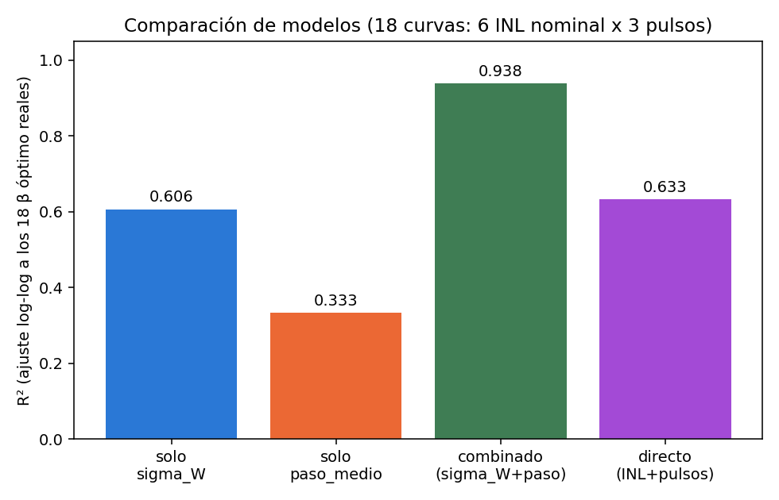
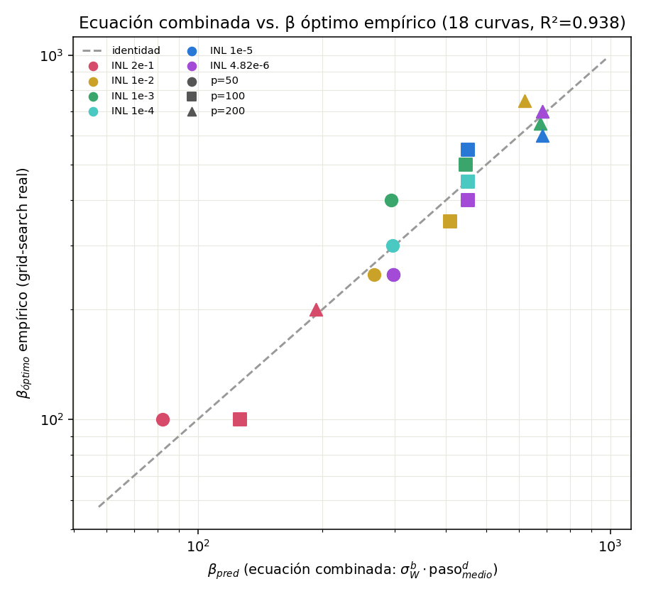
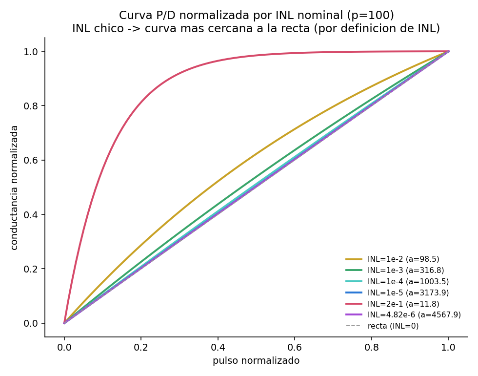
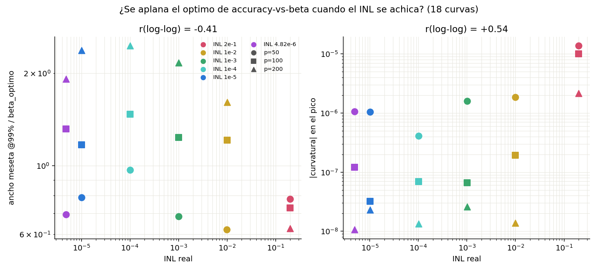

# La ecuación de β óptimo, revisada con 18 curvas (antes eran 6)

Walter Quiñonez · Reporte generado con Claude Code · 6 de septiembre de 2026

Este reporte repite el método de
[`reporte_formula_beta_optimo_propuesta.md`](reporte_formula_beta_optimo_propuesta.md)
(v1) con la data nueva: ya no son 6 curvas (2 INL nominal × 3 pulsos), son
**18 curvas (6 INL nominal × 3 pulsos)**, con INL nominal cubriendo casi
**4.4 órdenes de magnitud** (2e-1 .. 4.82e-6) en vez de solo 2 valores.
Además responde la pregunta que motivó este reporte: *¿las curvas de
accuracy vs beta se aplanan a medida que el INL se achica, porque la curva
P/D se vuelve más lineal?*

Script: [`estimar_beta_optimo_propuesta_v2.py`](estimar_beta_optimo_propuesta_v2.py).
No modifica ningún archivo existente; reutiliza sin alterar
`generar_curvas_pot_dep`/`G0_initialization` de
`MemCrossbarClass_beta_por_capa.py` y `cargar_curva` de
`data_beta_grid_search_SP/plot_accuracy_vs_beta_por_INL.py`.

## 1. La ecuación, ahora con 3× más puntos y sin el problema de confusión de v1

v1 advertía (Sección 5) que su exponente de σ_W (−3.02) estaba determinado
por **un solo contraste** entre 2 grupos de INL, no por una curva de
potencia muestreada en muchos puntos. Con 6 valores de INL nominal en vez
de 2, esa objeción ya no aplica: ahora hay grados de libertad reales para
poner a prueba la forma de la ley.

| Modelo | R² | n | gl residuales |
|---|---:|---:|---:|
| solo σ_W | 0.606 | 18 | 16 |
| solo paso_medio | 0.333 | 18 | 16 |
| **combinado (σ_W + paso_medio)** | **0.938** | 18 | 15 |
| directo (INL_real + pulsos) | 0.633 | 18 | 15 |



La ecuación combinada:

```
β_óptimo  ≈  1.34×10⁻¹¹  ·  σ_W^(−3.05)  ·  paso_medio^(−0.61)
```

(exponentes: −3.047 para σ_W, −0.607 para paso_medio; intercepto
exp(−25.05) ≈ 1.34×10⁻¹¹)

**Esto es la confirmación que a v1 le faltaba:** con 6 INL nominal en vez
de 2, el exponente de σ_W sale **−3.05**, prácticamente idéntico al −3.02
de v1 (ajustado con solo 2 grupos). El de paso_medio sale **−0.61**, muy
cerca del −0.64 de v1. La ecuación combinada explica **93.8%** de la
varianza (log-log) de los 18 β óptimo reales, con errores de predicción
entre −27% y +26% (ver tabla completa en
[`resultados_formula_propuesta_v2.csv`](resultados_formula_propuesta_v2.csv)).



También se probó un modelo mucho más simple y barato (sin Monte Carlo):
`β_óptimo ~ INL_real^b · pulsos^d`. Da R²=0.633 — mejor que σ_W sola pero
bastante peor que la combinada. Esto confirma que σ_W (la distribución de
pesos real, vía `G0_initialization`) captura algo que el INL nominal por sí
solo no captura del todo — no son intercambiables.

**Limitación que sigue en pie:** `N=784` y el dataset (MNIST) siguen fijos
en las 18 curvas, así que esos exponentes no son identificables con esta
data (absorbidos en la constante). Y aunque ahora hay 6 valores de INL, los
4 nuevos (1e-3, 1e-4, 1e-5, 4.82e-6) están muy cerca entre sí en el
régimen "ya casi lineal" (ver Sección 2) — la verdadera diversidad
geométrica de la curva P/D sigue concentrada en el contraste 2e-1 vs. el
resto, igual que en v1 (ver Sección 2).

## 2. "La curva P/D se vuelve más lineal cuando INL se achica": ¿válido?

Sí, pero hay que separar dos afirmaciones distintas que se mezclan en la
pregunta original.

### 2.1 Que la curva P/D se acerca a la recta cuando INL baja — esto es la
### definición de INL, no un hallazgo

`calcular_indice_nl()` (la función que define INL en todo el proyecto) es
literalmente `(L − d)/d`: el exceso de longitud de la curva sobre la
distancia recta, normalizado. INL = 0 significa curva perfectamente lineal
**por construcción**. Decir "INL chico ⇒ curva más lineal" es como decir
"un termómetro que marca 0°C está más frío que uno que marca 100°C": cierto,
pero no es una observación empírica sobre el sistema, es releer la
definición de la métrica.

Dicho esto, vale la pena verlo graficado para calibrar **cuánto** cambia
la forma, porque esa magnitud sí importa para la Sección 2.2:



El salto grande de curvatura ocurre entre INL=2e-1 (a=11.8, muy cóncava) e
INL=1e-2 (a=98.5, moderada). De ahí para abajo (1e-3, 1e-4, 1e-5, 4.82e-6 —
cuatro órdenes de magnitud más de "achicar el INL"), las curvas son
**visualmente indistinguibles entre sí y de la recta** a esta escala: la
curva ya "saturó" hacia la forma lineal mucho antes de llegar a INL=1e-5.
Esto es la clave para entender la Sección 2.2.

### 2.2 Que la curva de accuracy vs beta se aplana cuando INL baja — esto
### SÍ es empírico, y la respuesta es "solo parcialmente, y con matices"

Se midieron dos descriptores de "qué tan picuda" es cada una de las 18
curvas accuracy-vs-beta reales:

- **ancho de meseta @99%** (normalizado por β_óptimo): rango de β alrededor
  del pico donde accuracy ≥ 99% del máximo, con interpolación lineal en
  los bordes.
- **curvatura local en el pico**: coeficiente cuadrático de una parábola
  ajustada a los puntos cercanos al máximo (más cerca de 0 = más plana).



Correlación (log-log) a lo largo de las 18 curvas:

| Comparación | r (18 curvas, INL 2e-1..4.82e-6) | r (15 curvas, sin INL=2e-1) |
|---|---:|---:|
| INL vs. ancho meseta @99% / β_óptimo | −0.41 | −0.12 |
| INL vs. \|curvatura\| en el pico | +0.55 | +0.12 |

**Conclusión honesta:** la correlación completa (r=0.41–0.55) sugiere que
sí, en general, INL más chico ⇒ curva más plana. Pero al sacar el único
grupo con INL grande (2e-1) de la comparación, la correlación **se cae a
casi cero** (r=0.12) entre los 5 grupos restantes (1e-2 hasta 4.82e-6, que
ya cubren 4 órdenes de magnitud). Es decir: **el "aplanamiento" no es una
tendencia continua que sigue creciendo a medida que INL se achica más y
más** — es, otra vez, un efecto de **un solo contraste** (INL muy alto
=2e-1, curva P/D muy cóncava, óptimo de β muy picudo) **vs. todo lo demás**
(INL moderado a chico, curva P/D ya casi lineal, óptimo de β con meseta
ancha). Una vez que la curva P/D ya está "casi lineal" (que pasa a partir
de INL≈1e-2 en este sistema, ver Sección 2.1), seguir bajando el INL no
aplana más el óptimo de accuracy — coincide exactamente con que la propia
curva P/D tampoco se pone visiblemente "más recta" a partir de ahí.

Esto es coherente con lo que ya había encontrado v1 sobre σ_W (Sección 5
de ese reporte): con INL nominal solo en 2 valores, cualquier tendencia
"entre grupos" corre el riesgo de ser, en realidad, un efecto de un único
contraste. Con 6 valores de INL ahora se puede ver eso explícitamente en
vez de solo sospecharlo.

## 3. Conclusión

1. **La ecuación combinada de v1 se sostiene** con datos 3× más ricos y sin
   el problema de confusión que v1 mismo señalaba: `β_óptimo ≈ 1.34×10⁻¹¹ ·
   σ_W^(−3.05) · paso_medio^(−0.61)`, R²=0.938 sobre 18 curvas reales
   (antes: R²=0.947 sobre 6, con solo 2 valores de INL). Los exponentes
   casi no se movieron (−3.05 vs. −3.02; −0.61 vs. −0.64) — buena señal de
   que no era un ajuste espurio de v1.
2. **"INL chico ⇒ curva P/D más lineal"** es verdadero por definición de
   INL, no un hallazgo — pero graficarlo muestra que, en este sistema, la
   curva ya está casi saturada hacia la recta a partir de INL≈1e-2; seguir
   bajando el INL otras 3-4 décadas cambia poco su forma visible.
3. **"La curva de accuracy se aplana cuando INL se achica"** es cierta
   solo como contraste entre el régimen muy no-lineal (INL~0.2) y todo lo
   demás — no como una tendencia continua dentro del régimen ya casi
   lineal (INL≤1e-2). Los nuevos datos de INL=5e-2..5e-5 (actualmente
   corriendo en el cluster) van a ayudar a rellenar justo la zona de
   transición (entre 2e-1 y 1e-2) donde, según este análisis, está
   ocurriendo casi todo el efecto — y a confirmar si por debajo de 1e-2
   el aplanamiento sigue plano (como sugieren estos 18 puntos) o si con
   más resolución aparece algo de tendencia que acá no se alcanza a ver.

## 4. Registro de códigos usados

| Código | Uso en este reporte |
|---|---|
| [`estimar_beta_optimo_propuesta_v2.py`](estimar_beta_optimo_propuesta_v2.py) | **Único script nuevo.** Repite el Monte Carlo de v1 sobre las 18 curvas, agrega el análisis de planitud (ancho @99% y curvatura), y las 4 regresiones log-log. Genera `resultados_formula_propuesta_v2.csv`, `coeficientes_regresion_v2.csv` y las 4 figuras. |
| `estimar_beta_optimo_propuesta.py` (v1) | Método original (σ_W, paso_medio, Monte Carlo de corriente corregido); no modificado. |
| `MemCrossbarClass_beta_por_capa.py` → `generar_curvas_pot_dep()`, `G0_initialization()` | Usadas sin modificar, tal como en la red real. |
| `data_beta_grid_search_SP/plot_accuracy_vs_beta_por_INL.py` → `cargar_curva()` | Reutilizada sin modificar para obtener la curva completa (beta, accuracy) de cada carpeta y medir su planitud. |
| `data_beta_grid_search_SP/beta_grid_search_SP_INL_*/config_*.json` | Parámetros reales de cada una de las 18 curvas P/D. |
| `data_beta_grid_search_SP/resumen_por_INL/resumen_optimos.csv` | Los 18 β óptimo empíricos usados para el ajuste. |
| `X_train_mnist.npy` | Píxeles reales muestreados (respetando frecuencia) en el Monte Carlo de corriente. |

Archivos generados por este reporte (todos en `formula_beta_optimo_propuesta/`):
`estimar_beta_optimo_propuesta_v2.py`, `resultados_formula_propuesta_v2.csv`,
`coeficientes_regresion_v2.csv`, `curvas_PD_normalizadas_vs_INL_v2.png`,
`planitud_vs_INL_v2.png`, `beta_pred_combinada_vs_empirico_v2.png`,
`comparacion_R2_v2.png`, `reporte_formula_beta_optimo_propuesta_v2.md` (este archivo).
