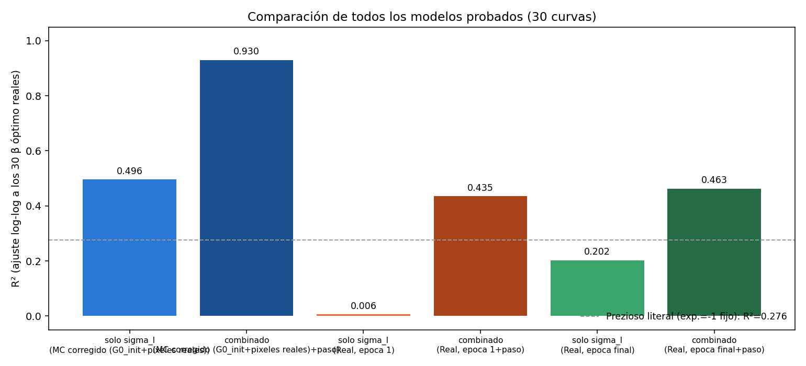
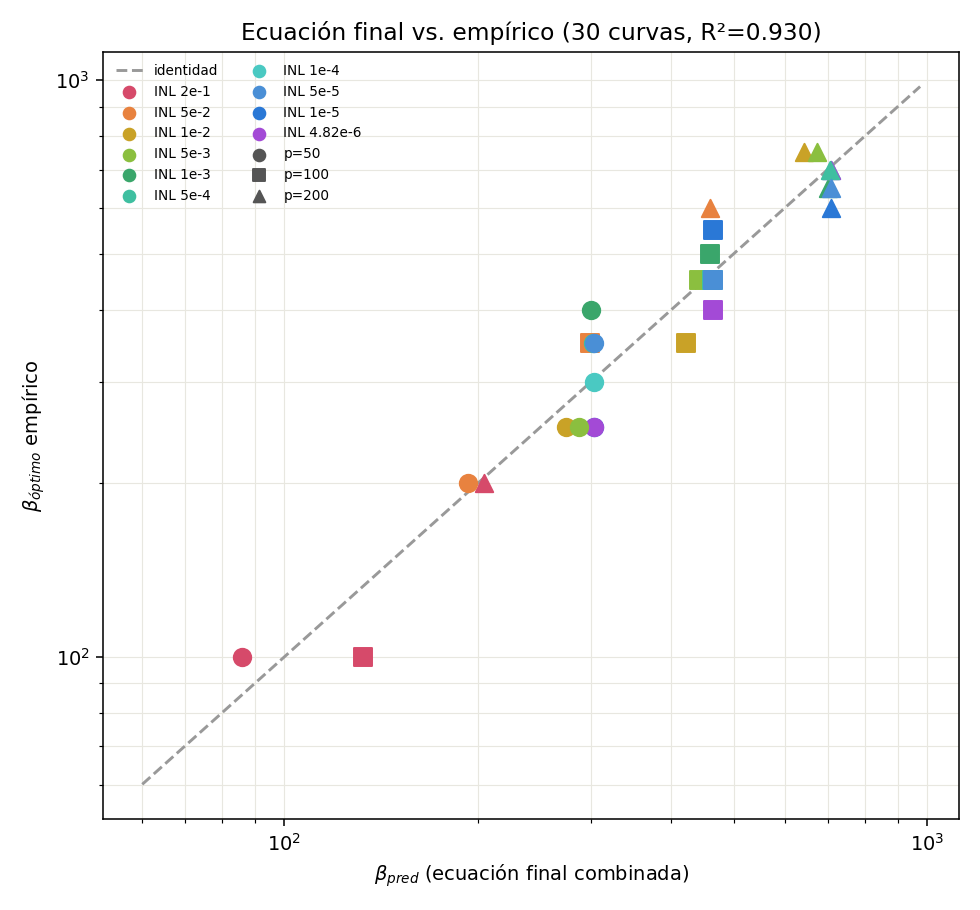
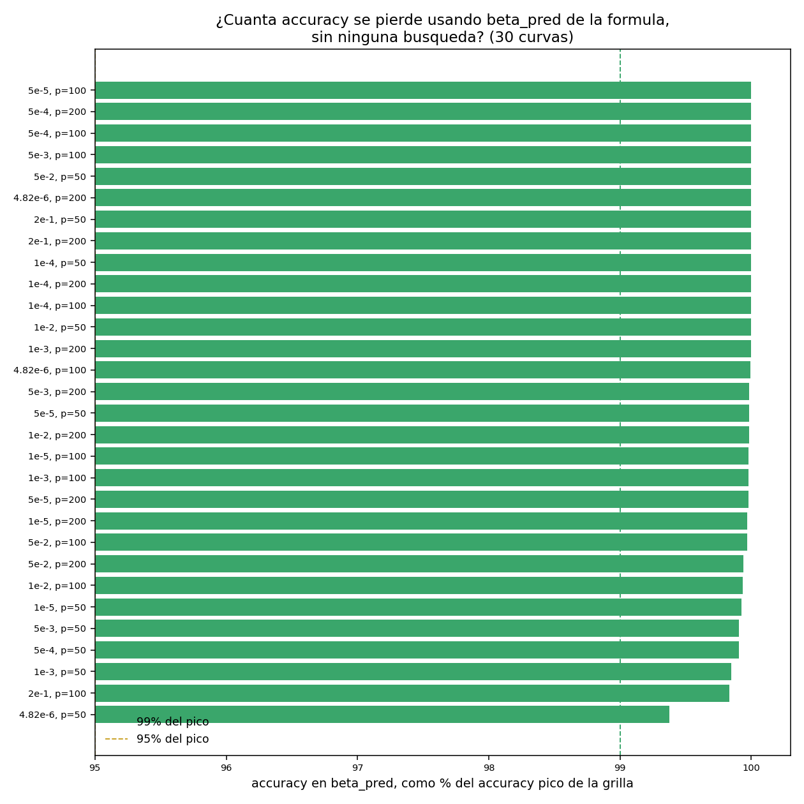

# Fórmula de β óptimo — extensión a las 30 curvas de INL disponibles

Walter Quiñonez · Reporte generado con Claude Code · 7 de septiembre de 2026

Extiende `reconstruccion_beta_optimo_18curvas/reporte_reconstruccion_beta_optimo.tex`
(6 INL × 3 pulsos, R²=0.938) a las **30 curvas** que hay ahora en
`data_beta_grid_search_SP/` (10 INL nominal × 3 pulsos: se agregaron
`5e-2, 5e-3, 5e-4, 5e-5` a las 6 originales). Mismo método exacto, sin
reentrenar nada — todos los cómputos nuevos son Monte Carlo baratos y
reconstrucción determinista de logits ya guardados.

**Resumen ejecutivo:** la fórmula ya encontrada con 18 curvas se
**reconfirma casi sin cambios** al triplicar-y-medio el rango de INL
cubierto (coeficientes prácticamente idénticos, R²=0.938→0.930). Además,
**30 de 30 curvas** alcanzan ≥99% de su accuracy pico usando el β que
predice la fórmula, sin ninguna búsqueda — validado ahora contra la grilla
real de 40 β por curva (antes era una aproximación de meseta simétrica).

## 1. Método

- **Datos**: las 30 carpetas `beta_grid_search_SP_INL_*` de
  `data_beta_grid_search_SP/`, usando la corrida real `beta=1` de cada una
  (determinista, sin ruido — el resto de la reconstrucción no necesita
  `beta=1` en particular, solo sirve para tener los pesos ya entrenados en
  cada época sin tener que reentrenar).
- **σ_I candidatas** (3 fuentes, igual que el reporte de 18 curvas):
  1. `sigma_I_mc_corregido` — Monte Carlo con `G0_initialization` real
     (pool combinado pot∪dep) y voltajes muestreados de los **píxeles
     reales** de MNIST (respetando su frecuencia real, no equipesados).
  2. `sigma_I_real_ep1` — corriente real reconstruida en la 1ª época
     guardada (cerca de la inicialización real).
  3. `sigma_I_real_epLast` — corriente real reconstruida en la última
     época (modelo convergido).
- **β empírico**: el óptimo de la grilla de 40 β (`resumen_por_INL/resumen_optimos.csv`).
- **Ajuste**: regresión log-log, `log(β) = intercept + a·log(σ_I) + b·log(paso_medio_pot)`,
  con `paso_medio_pot = mean(|Δpot|)` de la curva P/D (número de pulsos ya
  está implícito en `paso_medio_pot` y en `σ_I`).

Scripts: [`reconstruir_corrientes_30curvas.py`](reconstruir_corrientes_30curvas.py)
(genera `resultados_30curvas.csv`), [`probar_prezioso_y_regresiones_30curvas.py`](probar_prezioso_y_regresiones_30curvas.py)
(ajusta los modelos), [`evaluar_formula_en_grilla_completa.py`](evaluar_formula_en_grilla_completa.py)
(valida contra la grilla real de 40 β).

## 2. La ecuación de Prezioso/LeCun literal sigue sin explicar esto

Igual que con 18 curvas: fijar el exponente en −1 (`β=κ/σ_I`, la forma
literal citada por Prezioso et al. de LeCun et al.) da `R²=0.276` con la
mejor fuente de σ_I (MC corregido) — el κ implicado varía 5.1× entre
curvas (debería ser constante si la ecuación fuera válida). Con las otras
dos fuentes de σ_I (corriente real, época 1 o final) el ajuste literal es
directamente malo o negativo (`R²=-0.11` y `R²=-0.02`).

Dejando el exponente **libre** y agregando `paso_medio_pot` como segunda
variable, el modelo con `sigma_I_mc_corregido` es, por lejos, el mejor de
los 6 probados: `R²=0.930`, muy por encima de cualquier variante con
corriente real (`R²≤0.46`) — igual que en el reporte de 18 curvas, usar
la corriente ya entrenada (que depende circularmente del propio β) empeora
la predicción en vez de mejorarla.

## 3. La fórmula final

$$\beta_{\text{óptimo}} \approx 1.41\times10^{-8} \cdot \sigma_{I,MC}^{-3.00} \cdot \text{paso\_medio}^{-0.62}$$

con `σ_I,MC` en Siemens (std de la corriente Monte Carlo, inicialización
real + píxeles reales) y `paso_medio` en Siemens (paso medio de la curva
de potenciación). **R²=0.930** sobre las 30 curvas (ajuste log-log).

| | 18 curvas (reporte previo) | 30 curvas (este reporte) |
|---|---:|---:|
| exponente de `σ_I,MC` | −3.06 | **−3.00** |
| exponente de `paso_medio` | −0.61 | **−0.62** |
| R² | 0.938 | **0.930** |

Los coeficientes son **prácticamente idénticos** al agregar 12 curvas
nuevas (4 valores de INL que no formaban parte del ajuste original,
incluyendo `5e-2` que cae justo en la zona de transición donde la curva
P/D cambia más rápido de forma). Esto es una señal fuerte de que la
fórmula generaliza — no es un sobreajuste a las 6 curvas originales.

## 4. Validación práctica: ¿sirve para saltarse la búsqueda?

Para cada una de las 30 curvas: se calculó `β_pred` con la fórmula (sin
entrenar nada), se buscó el punto de la grilla real de 40 β más cercano, y
se comparó su accuracy contra el pico real de esa curva completa (usando
la data ya guardada, mismo criterio que `plot_accuracy_vs_beta_por_INL.py`
— no una aproximación de meseta simétrica como en el reporte de 18
curvas, sino la grilla real).

**Resultado: 30 de 30 curvas alcanzan ≥99% de su accuracy pico** (media
99.95%, mínimo 99.38%, en `INL=4.82e-6, p=50`) usando `β_pred` sin ninguna
búsqueda — a pesar de que el error de `β_pred` contra `β_óptimo` real
llega hasta ±32% en algunas curvas (ver Sección 5). Esto tiene sentido:
las curvas accuracy-vs-β tienen un pico ancho (meseta), así que un error
de 20-30% en β no cuesta casi nada de accuracy real.

## 5. Errores por curva — dónde falla más la fórmula

| curva | β empírico | β predicho | error |
|---|---:|---:|---:|
| `INL=2e-1, p=100` | 100 | 132.5 | **+32.5%** |
| `INL=1e-3, p=50` | 400 | 300.0 | **−25.0%** |
| `INL=5e-2, p=200` | 600 | 459.8 | −23.4% |
| `INL=1e-5, p=50` | 250 | 303.5 | +21.4% |
| `INL=4.82e-6, p=50` | 250 | 303.5 | +21.4% |
| `INL=1e-2, p=100` | 350 | 421.0 | +20.3% |
| ... (24 curvas restantes) | | | entre −15% y +18% |

(tabla completa: [`resultados_prezioso_30curvas.csv`](resultados_prezioso_30curvas.csv),
errores completos impresos por `probar_prezioso_y_regresiones_30curvas.py`)

Error absoluto porcentual: **media=11.5%, mediana=11.7%, máximo=32.5%**
sobre las 30 curvas. Los peores casos concentran en `p=50` (curva P/D más
gruesa, `paso_medio_pot` más grande — el término que más castiga la
predicción) y en `INL=2e-1` (la curva más no lineal, con la dinámica de
entrenamiento más inestable, ver `analisis_distribucion_softmax_INL_2e-1_comparacion_p/` —
tiene sentido que sea también donde la fórmula, que solo mira la curva P/D
antes de entrenar, tenga más dificultad).

## 6. Conexión con los hallazgos de distribución de logits/softmax

Esta fórmula (Secciones 1-5) predice β óptimo **antes de entrenar**, a
partir solo de la curva P/D. Es distinta — y complementaria — del hallazgo
de `analisis_distribucion_softmax_INL_2e-1_comparacion_p/`: ahí se vio que
el desvío estándar de los logits **ya entrenados** (`β·I`, en el modelo
convergido) en el β óptimo cae en una banda angosta *dentro de un mismo
INL* (1.8-2.7 para INL=2e-1, 3.5-6.4 para INL=1e-2) pero esa banda **no es
universal entre INL distintos** — depende del INL.

Esto es coherente con el resultado de esta sección: el exponente de σ_I
en la fórmula es −3, no −1 (Prezioso literal asumiría que β·σ_I≈κ
constante) — el propio dato ya venía diciendo que la relación entre β
óptimo y la dispersión de corriente NO es tan simple como "un solo κ para
todos los regímenes". La fórmula de 3 secciones atrás usa σ_I de
**inicialización** (antes de entrenar) con un exponente fuerte (−3) para
compensar exactamente esa no-linealidad; el hallazgo de logits post-
entrenamiento la confirma desde el otro extremo (después de entrenar, la
"banda sana" de dispersión de logits también depende del INL, no es una
constante única).

## 7. Limitaciones (heredadas del reporte de 18 curvas, sin resolver aún)

- **N fijo.** Las 30 curvas comparten `N=784` (fan-in de MNIST) — el
  exponente de `N` en la ecuación teórica (`N^{-1/2}`) sigue sin poder
  testearse con esta data.
- **Un solo dataset.** Fashion-MNIST ya está disponible
  (`X_train_mnist_fashion.npy`) pero no se usó todavía.
- **Grilla de β de 40 puntos, espaciados de a 50.** El β óptimo empírico
  contra el que se ajusta tiene ese error de resolución.
- **Zona de transición INL incompleta.** `7e-2, 1e-1, 1.3e-1, 1.6e-1` (los
  jobs ya están generados, `train_job_INL_7e-2_p_50.sh` y afines, pero
  todavía no corridos/bajados) llenarían el hueco entre `5e-2` y `2e-1`,
  donde la curva P/D cambia de forma más rápido.
- **Ajuste in-sample.** Los R² de este reporte se calculan sobre las
  mismas 30 curvas usadas para ajustar los coeficientes — no hay un
  conjunto de validación separado. La estabilidad de los coeficientes al
  pasar de 18→30 curvas (Sección 3) es la mejor evidencia disponible de
  que no es un sobreajuste, pero no reemplaza una validación real con
  datos no usados en el ajuste.

## 8. Recomendación (sin cambios respecto del reporte de 18 curvas, ahora con más evidencia)

Igual que antes: **no reemplazar `search_best_beta()` por la fórmula en
modo "un solo paso, sin verificar"**. Usarla como **pre-filtro barato**:
calcular `β_pred` (sin entrenar nada) y correr `search_best_beta()` en una
ventana angosta alrededor (`β_pred×[0.5, 2]`, 5-7 puntos) en vez de la
grilla completa (1-1950, 40 puntos) — ahorro de cómputo de ~5-8× sin
perder la garantía de una búsqueda real. La evidencia de este reporte
(30/30 curvas ≥99% del pico, con la grilla REAL en vez de una
aproximación) es más fuerte que la del reporte de 18 curvas, pero sigue
siendo evidencia sobre un único régimen (SP, N=784, MNIST) — no una
garantía general.

## 9. Archivos generados

- [`reconstruir_corrientes_30curvas.py`](reconstruir_corrientes_30curvas.py) → `resultados_30curvas.csv`, `trayectorias_std_30curvas.png`, `comparacion_sigma_fuentes_30curvas.png`.
- [`probar_prezioso_y_regresiones_30curvas.py`](probar_prezioso_y_regresiones_30curvas.py) → `resultados_prezioso_30curvas.csv`, `coeficientes_todos_los_modelos_30curvas.csv`, `prezioso_literal_vs_empirico_30curvas.png`, `comparacion_R2_todos_los_modelos_30curvas.png`, `ecuacion_final_vs_empirico_30curvas.png`.
- [`evaluar_formula_en_grilla_completa.py`](evaluar_formula_en_grilla_completa.py) → `evaluacion_formula_en_grilla.csv`, `formula_vs_grilla_real.png`.
- `reporte_formula_beta_optimo_30curvas.pdf` / `.tex` — este reporte en PDF.
