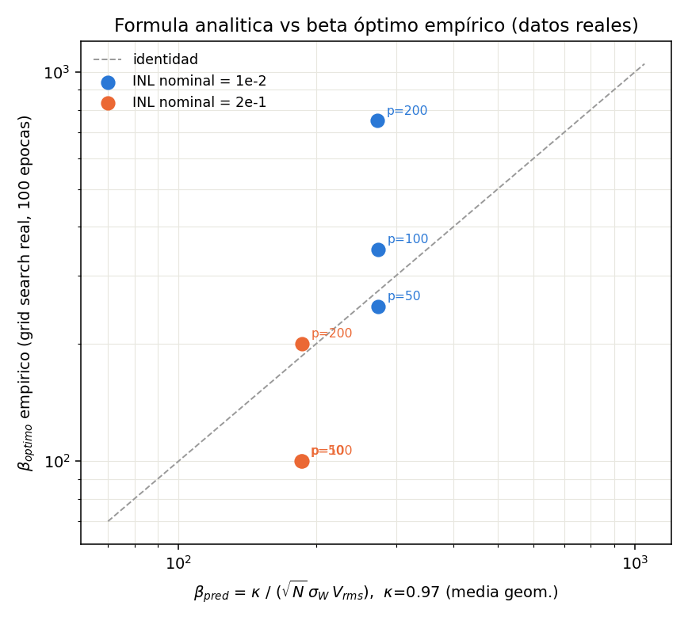
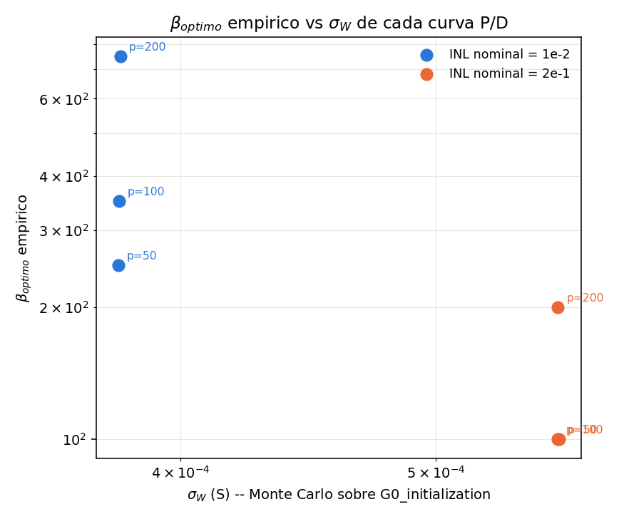

# Validación de la fórmula analítica de β óptimo contra datos reales de grid-search

Walter Quiñonez · Reporte generado con Claude Code · 5 de septiembre de 2026

Este reporte responde al pedido de `prompt.txt`: usar la data ya generada en
`data_beta_grid_search_SP/` (grid-search de β con entrenamiento **completo**:
100 épocas, k=5 folds, 20 series por β) para poner a prueba la fórmula
analítica de β óptimo propuesta en `papers/Reporte_beta_optimo_analitico.pdf`
—derivada a partir del rol de β en Prezioso et al. (Nature 521, 61, 2015) y
de la recomendación de LeCun et al. ("Efficient Backprop", 1998) que Prezioso
cita explícitamente para elegir su propio β. **No se corrió ninguna
simulación ni entrenamiento nuevo**: los únicos cómputos hechos en esta
sesión son estadísticas baratas (una llamada Monte Carlo a una función ya
provista, y un RMS sobre un dataset ya guardado), documentadas y registradas
en la Sección 5.

## 1. Papers revisados

| Paper | Rol en este reporte |
|---|---|
| `papers/APLED_2026.pdf` | Paper propio del proyecto. Modela la crossbar memristiva (`I_i = Σ_j (G⁺_ij − G⁻_ij) V_j`, salida `O_i = f(β·I_i)`) pero **no** da un método para elegir β; el mecanismo disponible en el código es únicamente `search_best_beta` (grid-search + K-fold), costoso. |
| `papers/prezioso2015.pdf` | Origen físico del esquema `I = ΣW_ij V_j`, `f_i = tanh(β I_i)`. Prezioso et al. usan `β = 2×10⁵ A⁻¹` "según la recomendación de la Ref. 28 [LeCun et al., *Efficient Backprop*], confirmado por simulaciones propias" — sin publicar la fórmula concreta. |
| `papers/Reporte_beta_optimo_analitico.pdf` | Reporte previo del proyecto (29/08/2026) que **deriva** la fórmula candidata (Ec. *, Sección 2 de este reporte) a partir de ese mismo argumento de Prezioso/LeCun, y la explora con una búsqueda reducida (1 época por candidato, submuestra de datos). Es la fórmula que este reporte valida con datos reales. |
| `papers/ncomms3072.pdf` (Alibart et al., *Nat. Commun.* 4, 2072, 2013) | Antecedente adicional del mismo esquema `I=ΣW_ijV_j` citado en el reporte previo; no aporta una fórmula de β adicional. |

## 2. La fórmula a validar

Modelando `I_i = Σ_{j=1}^{N} W_ij V_j` como una suma de `N` términos
aproximadamente independientes (Teorema Central del Límite), con `W_ij`
inicializados al azar (`G0_initialization('random', ...)`, cada `G⁺_ij` y
`G⁻_ij` tomado independientemente del conjunto agrupado {curva pot} ∪
{curva dep}) y `V_j` los voltajes de entrada:

```
sigma_I = sqrt(N) * sigma_W * V_rms

beta_optimo ~ kappa / (sqrt(N) * sigma_W * V_rms)          (*)
```

- `N`: número de entradas de la capa (arquitectura SP `[784, 10]` ⇒ `N=784`).
- `sigma_W`: desvío estándar de `W = G⁺ − G⁻` bajo la inicialización aleatoria
  del código, propio de cada curva P/D (depende de `Gmin`, `Gmax`, número de
  pulsos y parámetro `a`).
- `V_rms = sqrt(E[V²])` de los voltajes de codificación (píxeles de MNIST).
- `kappa`: constante `O(1–10)` — la dispersión objetivo del argumento de la
  no linealidad para que `softmax(β·I)` no sature ni quede demasiado chato.

## 3. Datos usados (ya generados, sin recomputar)

`data_beta_grid_search_SP/` contiene **6 grid-searches completos**, uno por
combinación de:

- **INL nominal**: `1e-2` (curva casi lineal) y `2e-1` (curva muy no lineal).
- **Número de pulsos** de la curva P/D: `p = 50, 100, 200` (con su `a`
  correspondiente ajustado para mantener el INL nominal fijo, ver tabla).

Cada corrida entrena una red SP (`sizes=[784,10]`, sin bias) sobre MNIST
completo (`X_train_mnist.npy`, `amplitud_imagen=1`), `Rlow=1000 Ω`,
`Rhigh=10000 Ω` (`Gmin=1e-4 S`, `Gmax=1e-3 S`), concavidad `pot='pos'` /
`dep='neg'`, con una grilla de 40 valores de β (`1, 50, 100, …, 1950`),
`k_folds=5`, `20 series`, `100 épocas` por serie/fold/β — es decir, el
entrenamiento **converge**, a diferencia de la búsqueda reducida (1 época)
del reporte analítico previo. El β óptimo empírico de cada curva ya estaba
calculado en `data_beta_grid_search_SP/resumen_por_INL/resumen_optimos.csv`
(generado por `plot_accuracy_vs_beta_por_INL.py`, incluido en el proyecto):
para cada β de la grilla se promedia el accuracy final (última época) sobre
todas las series×folds disponibles, y se toma el β que maximiza ese
promedio.

Los picos accuracy-vs-β (`data_beta_grid_search_SP/resumen_por_INL/accuracy_vs_beta_INL_1e-2.png`
y `..._2e-1.png`, figuras ya existentes, no regeneradas aquí) muestran picos
genuinos y no meseta degenerada, salvo el caso `INL=1e-2, p=200`, cuya curva
es casi plana entre β≈150 y β≈1000 (91–92% de accuracy en todo ese rango):
ahí el "óptimo" puntual es sensible al ruido y a la resolución de la grilla
(paso 50).

## 4. Método

Script nuevo: [`validar_beta_optimo.py`](validar_beta_optimo.py) (el único
código nuevo de este reporte). Para cada una de las 6 curvas:

1. Lee `pulsos_pot`, `a_pot`, `Gmin`, `Gmax`, concavidad del `config_*.json`
   real de esa corrida (no se transcriben números a mano).
2. Genera `pot`, `dep` con `generar_curvas_pot_dep(...)` — función ya
   provista en `MemCrossbarClass_beta_por_capa.py`, importada sin modificar.
3. Estima `sigma_W` por Monte Carlo: una única llamada a
   `G0_initialization('random', pot, dep, D_in=20000, D_out=10)` (función ya
   provista) y calcula `std(G[:,0::2] − G[:,1::2])`. `D_in=20000` es solo para
   tener una muestra grande y estable de `sigma_W`; no representa el tamaño
   real de la crossbar (`N=784` se usa aparte, en la fórmula).
4. Calcula `V_rms` sobre `X_train_mnist.npy` (el mismo dataset del grid
   search).
5. Compara contra `beta_optimo` empírico de `resumen_optimos.csv`.

Ningún entrenamiento de red se ejecuta en este script; solo estadística
sobre funciones y datos ya provistos.

## 5. Resultados

| INL nominal | p (pulsos) | a | σ_W (S) | β_pred (κ=1) | β_óptimo empírico | acc. óptima | κ implicado |
|---|---:|---:|---:|---:|---:|---:|---:|
| 1e-2 | 50  | 48.83  | 3.789e-04 | 281.7 | **250** | 89.47% | 0.89 |
| 1e-2 | 100 | 98.55  | 3.790e-04 | 281.6 | **350** | 90.91% | 1.24 |
| 1e-2 | 200 | 197.99 | 3.796e-04 | 281.1 | **750** | 91.63% | 2.67 |
| 2e-1 | 50  | 5.85   | 5.570e-04 | 191.6 | **100** | 84.70% | 0.52 |
| 2e-1 | 100 | 11.82  | 5.563e-04 | 191.9 | **100** | 86.57% | 0.52 |
| 2e-1 | 200 | 23.76  | 5.565e-04 | 191.8 | **200** | 88.96% | 1.04 |

`V_rms(X_train_mnist.npy) = 0.33467`, `N = 784` en las 6 filas.

**κ implicado** (`= β_óptimo,emp · √N · σ_W · V_rms`): media geométrica
**0.97** — dentro del rango `O(1–10)` que predice el argumento de
LeCun/Prezioso — pero con un rango `[0.52, 2.67]` (cociente máx/mín = 5.1).
Ajuste log-log `β_óptimo ~ (1/(√N σ_W V_rms))^slope` sobre las 6 filas:
`slope = 3.0` (teoría: 1), `R² = 0.68` — dominado por el hecho de que `σ_W`
casi no cambia entre `p=50,100,200` de un mismo INL nominal (por diseño: `a`
se ajustó para eso) mientras que `β_óptimo` sí cambia mucho.




### 5.1 Lo que la fórmula (*) SÍ predice bien

- **Orden de magnitud**: κ≈1 en las 6 curvas, consistente con la
  recomendación de LeCun/Prezioso (`O(1–10)`) y con la verificación externa
  ya hecha en el reporte analítico previo contra el hardware real de
  Prezioso et al. (κ≈3, mismo orden).
- **Dirección entre ventanas de no linealidad distintas**: el grupo
  `INL=2e-1` tiene `σ_W` más grande (0.557 mS vs. 0.379 mS) y, en las 6
  filas, `β_óptimo` es sistemáticamente más chico en ese grupo (100–200
  frente a 250–750) — la misma dirección que predice (*) y que ya había
  encontrado el reporte previo (Barrido C) con una búsqueda reducida.

### 5.2 Lo que la fórmula (*) NO predice

- **Dependencia con el número de pulsos a INL fijo.** Dentro de un mismo INL
  nominal, `a_pot` se ajusta junto con `p` para mantener `σ_W` casi
  constante (variación <1% entre `p=50,100,200`), así que (*) predice
  prácticamente el mismo `β_óptimo` para los tres. La red entrenada
  completa dice lo contrario: `β_óptimo` **crece con `p`** en ambos INL
  (250→350→750 y 100→100→200). Esto reproduce, ahora con entrenamiento
  convergido (100 épocas) en vez de 1 época, el mismo resultado negativo que
  ya había anticipado `Reporte_beta_optimo_analitico.pdf` (Sección 4.3 y
  Sección 5, punto 7): `σ_W` describe la **distribución estática agrupada**
  de conductancias en la inicialización, pero no la **resolución/paso de la
  regla de Manhattan** (cuántos niveles de conductancia hay entre `Gmin` y
  `Gmax`), que sí depende fuertemente de `p`.

### 5.3 Diagnóstico exploratorio: paso medio de la curva P/D

Como chequeo de la sugerencia del propio reporte previo (Sec. 5, punto 7:
"un descriptor relacionado con la pendiente local de la curva P/D, no solo
`σ_W`"), el script también calcula, sin agregar ningún método nuevo,
`paso_medio = mean(|pot[i+1] − pot[i]|)` de la curva ya generada por
`generar_curvas_pot_dep`, y el `κ₂` implicado al reemplazar `σ_W` por ese
paso medio en (*):

| carpeta | paso_medio_pot (S) | κ₂ implicado |
|---|---:|---:|
| INL 1e-2, p=50  | 1.815e-05 | 0.0425 |
| INL 1e-2, p=100 | 9.038e-06 | 0.0296 |
| INL 1e-2, p=200 | 4.509e-06 | 0.0317 |
| INL 2e-1, p=50  | 1.837e-05 | 0.0172 |
| INL 2e-1, p=100 | 9.091e-06 | 0.0085 |
| INL 2e-1, p=200 | 4.523e-06 | 0.0085 |

Dentro de cada INL, `p=100` y `p=200` quedan muy consistentes entre sí
(κ₂ difiere menos del 7%) — mucho mejor que con `σ_W` — pero `p=50` sigue
siendo un valor atípico en ambos grupos (~1.4×–2× más alto), y el `κ₂` no es
la misma constante entre los dos INL (difiere ×3.5, mientras que con `σ_W`
la Sección 5.1 mostraba que la dirección entre INL sí se explica). Es decir:
**ningún descriptor único (σ_W o paso medio) explica ambos ejes a la vez**
(INL/ventana de conductancia por un lado, número de pulsos por el otro) con
las 6 curvas disponibles. Esto es exactamente el resultado "mixto" que el
reporte previo ya anticipaba, ahora confirmado con entrenamiento real
convergido en vez de una búsqueda reducida de 1 época. Nótese además que
`p=50` es, en ambos INL, el caso con el pico de accuracy más chato/inestable
en la figura de accuracy-vs-β (Sección 3), lo que puede inflar el ruido de
su β_óptimo puntual además del efecto físico.

## 6. Conclusiones

1. **La fórmula (*) da el orden de magnitud correcto** de β_óptimo (κ
   implicado ≈ 1, dentro de `O(1–10)`) en las 6 configuraciones reales
   validadas aquí, con entrenamiento **completo** (100 épocas) — no solo en
   la búsqueda reducida del reporte previo ni en el chequeo externo contra
   Prezioso et al.
2. **Predice correctamente la dirección** del efecto de la ventana de
   conductancia/no linealidad global (`σ_W` más grande ⇒ β_óptimo más
   chico) entre los dos grupos de INL nominal.
3. **No predice** el efecto, igual de grande, del número de pulsos de la
   curva P/D a INL nominal fijo: β_óptimo sube claramente con `p` mientras
   `σ_W` se mantiene ~constante por diseño del experimento. Reemplazar
   `σ_W` por el paso medio de la curva mejora la consistencia dentro de un
   mismo INL (salvo `p=50`) pero rompe la consistencia entre INL — ningún
   descriptor único usado aquí captura los dos efectos a la vez.
4. **Recomendación práctica** (igual que ya sugería el reporte previo): (*)
   sirve como **estimador inicial de orden de magnitud** para acotar el
   rango de `search_best_beta` (por ejemplo, `β ∈ [β_pred/3, β_pred·10]` con
   `κ≈1–3`) y ahorrar cómputo de grilla, pero **no reemplaza** la búsqueda
   por grid-search+K-fold para fijar el valor final: la propia variación de
   κ (factor 5× entre las 6 curvas) indica que el resultado de (*) por sí
   solo no es preciso.
5. Esta validación usa 6 puntos con `N=784` fijo (no vuelve a poner a
   prueba la dependencia con el tamaño de la crossbar, ya explorada — con
   una búsqueda reducida — en el Barrido A del reporte previo). Sería
   valioso repetir este mismo procedimiento de validación, con datos de
   entrenamiento completo como los de `data_beta_grid_search_SP/`, para un
   barrido de `N` y de arquitectura MLP (β por capa), cuando existan esos
   datos.

## 7. Registro de códigos usados

Nada de lo siguiente fue modificado; se usó tal cual está en el repositorio.

| Código | Uso en este reporte |
|---|---|
| [`validar_beta_optimo.py`](validar_beta_optimo.py) | **Único script nuevo.** Calcula σ_W (Monte Carlo), V_rms, β_pred y compara con `resumen_optimos.csv`. Genera `resultados_validacion_beta_optimo.csv`, `beta_pred_vs_empirico.png`, `beta_pred_vs_sigmaW.png`. |
| `MemCrossbarClass_beta_por_capa.py` → `generar_curvas_pot_dep()` | Genera las curvas `pot`/`dep` reales de cada configuración (mismos parámetros que el grid search). |
| `MemCrossbarClass_beta_por_capa.py` → `G0_initialization('random', ...)` | Muestreo Monte Carlo de `W = G⁺ − G⁻` para estimar σ_W. |
| `Crossbar_train_experimento_beta_por_capa.py` | No se ejecutó; se usó solo para confirmar parámetros fijos del grid search (N=784, Gmin/Gmax, dataset, arquitectura SP) y el significado de los campos de los `config_*.json`. |
| `data_beta_grid_search_SP/plot_accuracy_vs_beta_por_INL.py` | No se ejecutó en esta sesión; ya había generado `resumen_por_INL/resumen_optimos.csv` y las figuras `accuracy_vs_beta_INL_*.png` usadas como fuente de verdad empírica y como contexto de forma de los picos (Sección 3). |
| `data_beta_grid_search_SP/analizar_distribucion_por_INL.py` | No se ejecutó; mencionado solo como el script que generó las figuras de dispersión/asimetría de `resumen_por_INL/` (no usadas directamente en este reporte). |
| `data_beta_grid_search_SP/beta_grid_search_SP_INL_*/config_*.json` | Fuente de los parámetros reales (`pulsos_pot`, `a_pot`, `Gmin`, `Gmax`, concavidad) de cada una de las 6 curvas. |
| `X_train_mnist.npy` | Dataset real usado para calcular V_rms (idéntico al usado en el grid search). |
| `papers/Reporte_beta_optimo_analitico.pdf` | Fuente de la fórmula (*) validada aquí y de la sugerencia de diagnóstico (paso medio, Sección 5.3). |

Archivos generados por este reporte (todos en esta carpeta,
`validacion_formula_beta_optimo/`):
`validar_beta_optimo.py`, `resultados_validacion_beta_optimo.csv`,
`beta_pred_vs_empirico.png`, `beta_pred_vs_sigmaW.png`,
`reporte_validacion_beta_optimo.md` (este archivo).
